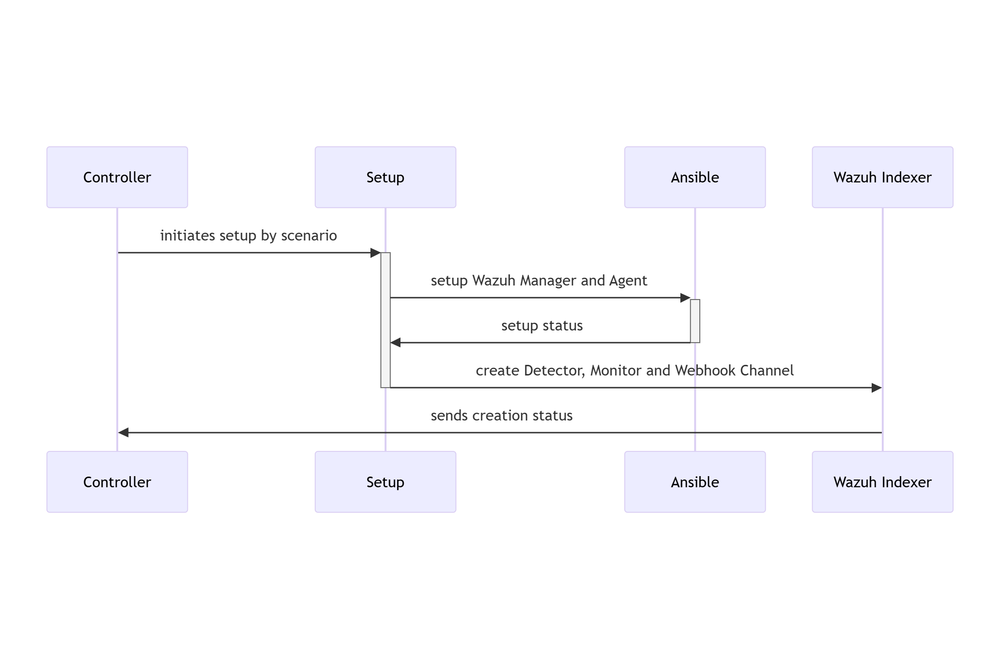

# RATF: setup phase

## Sequence diagram of environment setup in RATF

The diagram below depicts the sequence of actions orchestrated by the RADAR Automated Test Framework in setup phase, which
- sets up Docker environments by copying rules, active responses and setting needed permissions.

{: width="80%"}