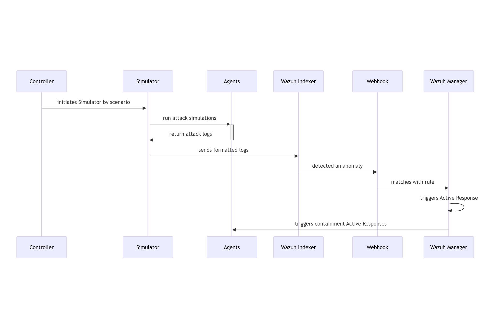

# RATF: simulation phase

## Sequence diagram of threat simulation in RATF

The diagram below depicts the sequence of actions orchestrated by the RADAR Automated Test Framework in simulation phase, which
- simulates the threat scenario in corresponding agent
- feeds the resulted log to corresponding index in Opensearch.

{: width="80%"}