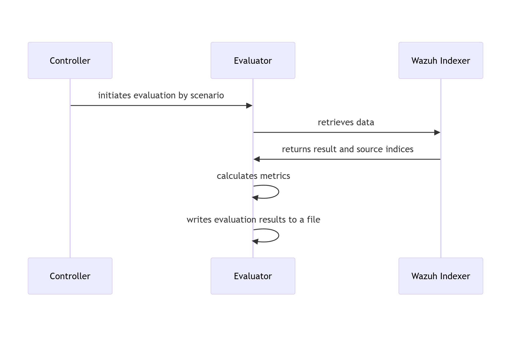

# RATF: evaluation phase

## Sequence diagram of metrics evaluation in RATF

The diagram below depicts the sequence of actions orchestrated by the RADAR Automated Test Framework in evaluation phase, which
- retrieves the events from corresponding index to scenario
- calculates evaluation metrics by comparing with the dataset and simulation results.

{: width="80%"}