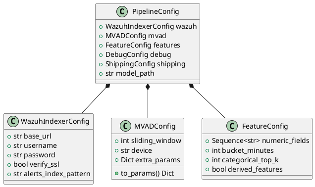
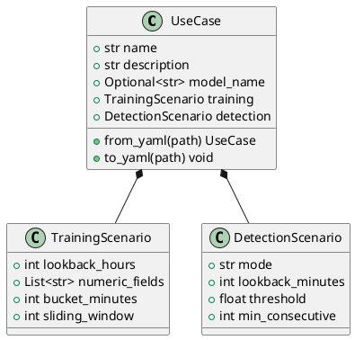

# SONAR class structure and relationships

## Class diagram overview

The SONAR subsystem employs a modular class structure organized around configuration management, data access, and processing pipelines.

### Core configuration classes

### Scenario management classes

## Design patterns

| Pattern | Application | Benefit |
|---------|-------------|---------|
| **Dataclasses** | Configuration objects | Type safety, immutability, validation |
| **Factory Method** | `UseCase.from_yaml()` | Encapsulates YAML parsing logic |
| **Strategy** | Data providers (Wazuh/Local) | Interchangeable data sources |
| **Facade** | Engine wrapper | Simplifies MVAD library interface |

## Related documentation

- Complete class diagram: `docs/manual/sonar_docs/uml-diagrams.md#class-diagram`
- Architecture guide: `docs/manual/sonar_docs/architecture.md#module-structure`