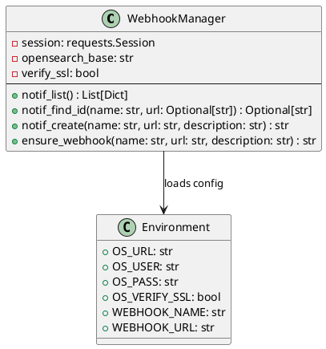
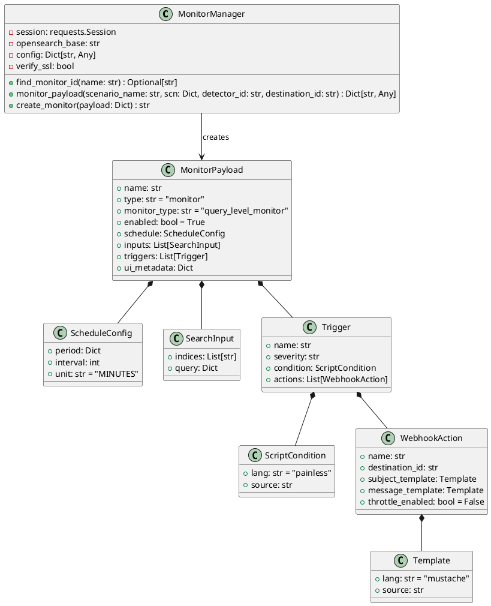
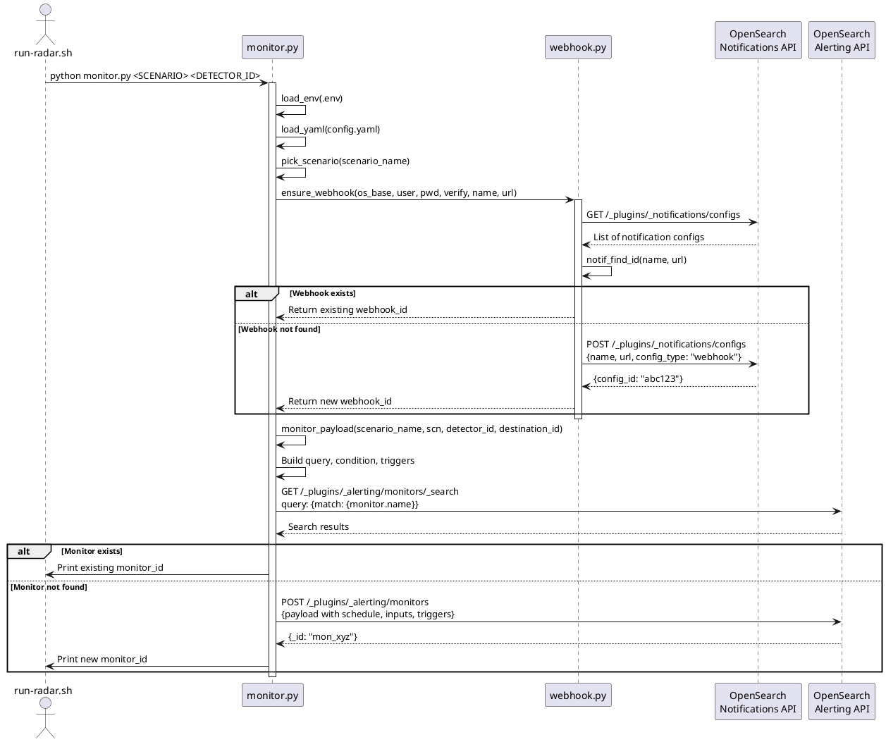

# RADAR monitor and webhook module design

This document specifies the detailed design of the monitor and webhook Python modules used in RADAR's anomaly detection workflow. These modules create and configure OpenSearch monitors and webhook notification channels.

## Module overview

The RADAR anomaly detector subsystem consists of two primary modules:

- **webhook.py**: Manages OpenSearch notification channel destinations for webhook endpoints
- **monitor.py**: Creates OpenSearch alerting monitors that evaluate detector results and trigger webhook notifications

## webhook.py class structure



### Key functions

| Function | Purpose | Returns |
|----------|---------|---------|
| `notif_list()` | Query all notification configurations | List of notification configs |
| `notif_find_id(name, url)` | Search for existing webhook by name and URL | Webhook destination ID or None |
| `notif_create(name, url, description)` | Create new webhook destination | Webhook destination ID |
| `ensure_webhook(name, url, description)` | Idempotent webhook creation (find or create) | Webhook destination ID |

## monitor.py class structure



## Monitor creation sequence



## Monitor payload structure

The monitor payload includes:

**Schedule**: Evaluation frequency

- Default: Uses `detector_interval` from scenario config
- Override: `monitor_interval` if specified
- Unit: MINUTES

**Search Input**: Query against detector result index

- Index pattern: `{result_index}` from scenario
- Time range: Last N minutes (where N = interval)
- Filter: `detector_id` matches created detector
- Aggregation: `max(anomaly_grade)`

**Trigger Condition** (Painless script):
```painless
return ctx.results != null &&
       ctx.results.length > 0 &&
       ctx.results[0].aggregations.max_anomaly_grade.value > {grade_threshold} &&
       ctx.results[0].hits.hits[0]._source.confidence > {confidence_threshold}
```

**Webhook Action Message**:
```json
{
  "monitor": {"name": "{{ctx.monitor.name}}"},
  "trigger": {"name": "{{ctx.trigger.name}}"},
  "entity": "{{ctx.results.0.hits.hits.0._source.entity.0.value}}",
  "periodStart": "{{ctx.periodStart}}",
  "periodEnd": "{{ctx.periodEnd}}",
  "anomaly_grade": "{{ctx.results.0.hits.hits.0._source.anomaly_grade}}",
  "anomaly_confidence": "{{ctx.results.0.hits.hits.0._source.confidence}}"
}
```

## Configuration parameters

From `config.yaml` scenario section:

| Parameter | Default | Description |
|-----------|---------|-------------|
| `monitor_interval` | `detector_interval` | Monitor evaluation frequency (minutes) |
| `detector_interval` | 5 | Detector run interval (minutes) |
| `anomaly_grade_threshold` | 0.2 | Minimum anomaly grade to trigger (0-1) |
| `confidence_threshold` | 0.2 | Minimum confidence to trigger (0-1) |
| `result_index` | `opensearch-ad-plugin-result-{scenario}` | Detector result index pattern |
| `monitor_name` | `{scenario}-monitor` | Monitor name |
| `trigger_name` | `{scenario}-trigger` | Trigger name |

From `.env` file:

| Variable | Required | Description |
|----------|----------|-------------|
| `OS_URL` | Yes | OpenSearch endpoint URL |
| `OS_USER` | No | OpenSearch username (if auth enabled) |
| `OS_PASS` | No | OpenSearch password |
| `OS_VERIFY_SSL` | No | SSL certificate verification (default: true) |
| `WEBHOOK_NAME` | No | Webhook destination name (default: "RADAR Webhook") |
| `WEBHOOK_URL` | Yes | Webhook endpoint URL (e.g., http://manager:8080/notify) |

## Error handling

Both modules implement robust error handling:

- **Connection errors**: HTTP status validation with detailed error messages
- **Missing configuration**: Explicit validation of required environment variables
- **API failures**: Graceful exit with status codes and response text
- **Idempotency**: `find_monitor_id()` and `notif_find_id()` check for existing resources

## Integration with RADAR workflow

1. `run-radar.sh` executes `detector.py` to create OpenSearch AD detector
2. Detector ID is passed to `monitor.py` as command-line argument
3. `monitor.py` calls `webhook.ensure_webhook()` to get/create notification channel
4. `monitor.py` builds monitor payload with detector ID and webhook destination ID
5. Monitor is created and begins evaluating detector results at configured intervals
6. When anomalies exceed thresholds, monitor triggers webhook POST to configured endpoint