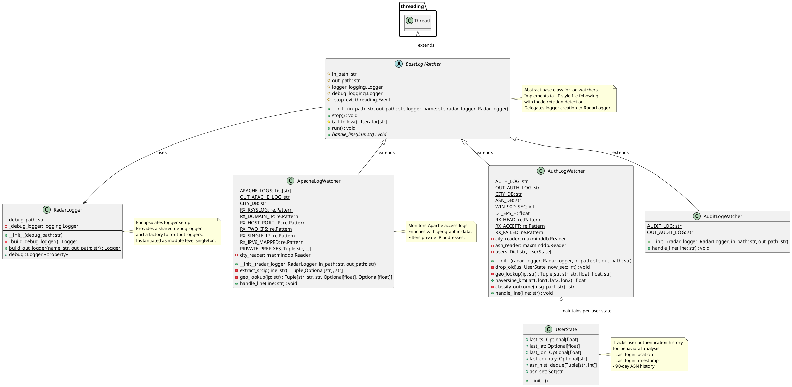
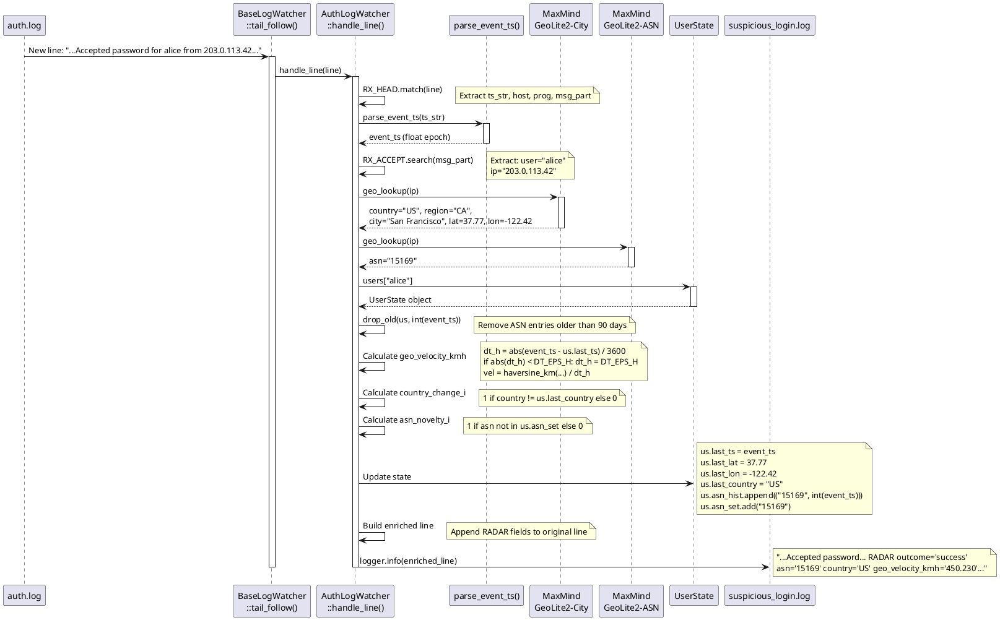

# RADAR helper module class design

This document specifies the detailed class design of the RADAR Helper Python daemon that provides real-time log enrichment for geographic and behavioral anomaly detection on Wazuh agents.

## Module overview

The RADAR Helper (`radar-helper.py`) is a multi-threaded Python daemon service that:

1. Monitors authentication logs (SSH) and Apache HTTP access logs in real-time
2. Enriches log events with geographic metadata (country, region, city, coordinates)
3. Calculates behavioral indicators for SSH authentication (geographic velocity, ASN novelty, country changes)
4. Writes enriched logs for Wazuh agent ingestion

## Class hierarchy



## Module-level elements

### Constants

| Constant | Value | Description |
|----------|-------|-------------|
| `DEBUG_LOG` | `/var/log/radar-helper-debug.log` | Path for the shared debug log file |

### Globals

| Name | Type | Description |
|------|------|-------------|
| `RADAR_LOG` | `RadarLogger` | Module-level singleton providing the shared debug logger and output logger factory |

### Helper functions

#### parse_event_ts()

Parses a timestamp string from a log line header into a Unix epoch float. Supports two formats:

- **ISO 8601** (e.g., `2024-01-15T10:30:00+01:00`): parsed via `datetime.fromisoformat()`
- **Syslog** (e.g., `Jan 15 10:30:00`): parsed using a regex and current system year

Falls back to `time.time()` if the string matches neither format.

```
parse_event_ts(ts_str: str) -> float
```

This function is used by `AuthLogWatcher.handle_line()` to ensure that behavioral indicators such as geographic velocity are computed against the actual event time recorded in the log, rather than the processing time.

---

## RadarLogger class

Encapsulates all logger configuration and acts as a factory for output loggers. A module-level singleton (`RADAR_LOG`) is created at import time.

### Attributes

| Attribute | Type | Description |
|-----------|------|-------------|
| `debug_path` | str | Path to the debug log file |
| `_debug_logger` | logging.Logger | Configured WatchedFileHandler-based debug logger |

### Methods

| Method | Parameters | Returns | Description |
|--------|------------|---------|-------------|
| `__init__()` | debug_path | - | Initialize and build the debug logger |
| `_build_debug_logger()` | - | Logger | Create a `WatchedFileHandler` logger at `DEBUG` level with timestamp formatting |
| `build_out_logger()` *(static)* | name, out_path | Logger | Create an `INFO`-level `WatchedFileHandler` logger writing plain messages |
| `debug` *(property)* | - | Logger | Returns `_debug_logger` |

### Design notes

`build_out_logger()` is a static method so that `BaseLogWatcher` subclasses can call it without needing an instance reference, while still having the logger setup logic centralized in one place. Both `_build_debug_logger()` and `build_out_logger()` are idempotent: if a handler for the target path already exists on the logger, a second handler is not added.

---

## BaseLogWatcher class

Abstract base class providing tail-style log monitoring with log rotation handling. Extends `threading.Thread`.

### Attributes

| Attribute | Type | Description |
|-----------|------|-------------|
| `in_path` | str | Input log file path to monitor |
| `out_path` | str | Output log file path for enriched logs |
| `logger` | logging.Logger | Output logger, obtained from `RadarLogger.build_out_logger()` |
| `debug` | logging.Logger | Debug logger, obtained from `radar_logger.debug` |
| `_stop_evt` | threading.Event | Thread stop signal |

### Constructor

```
__init__(in_path, out_path, logger_name, radar_logger: RadarLogger)
```

The constructor delegates logger creation to `RadarLogger`: the output logger is obtained via `radar_logger.build_out_logger(logger_name, out_path)` and the debug logger via `radar_logger.debug`.

### Methods

| Method | Parameters | Returns | Description |
|--------|------------|---------|-------------|
| `stop()` | - | void | Set `_stop_evt` to signal graceful thread termination |
| `tail_follow()` | - | Iterator[str] | Generator yielding new log lines with inode-based rotation detection |
| `run()` | - | void | Main thread loop: iterates `tail_follow()` and calls `handle_line()` per line |
| `handle_line()` | line | void | **Abstract**: process a single log line; must be overridden in subclasses |

### Key features

**Inode rotation detection**:
```python
st = os.stat(self.in_path)
if st.st_ino != ino:
    # File was rotated, reopen
    nf = open(self.in_path, "r")
    f.close()
    f = nf
    ino = os.fstat(f.fileno()).st_ino
```

**Graceful shutdown**: The thread runs as a daemon. The stop event allows clean termination and file handles are closed on exit.

---

## AuthLogWatcher class

Concrete implementation monitoring SSH authentication logs with geographic enrichment.

### Class attributes

| Attribute | Type | Description |
|-----------|------|-------------|
| `AUTH_LOG` | str | `/var/log/auth.log` — default input log path |
| `OUT_AUTH_LOG` | str | `/var/log/suspicious_login.log` — default output log path |
| `CITY_DB` | str | `/usr/share/GeoIP/GeoLite2-City.mmdb` |
| `ASN_DB` | str | `/usr/share/GeoIP/GeoLite2-ASN.mmdb` |
| `WIN_90D_SEC` | int | `7,776,000` — ASN history window in seconds (90 days) |
| `DT_EPS_H` | float | `1e-9` — minimum time delta in hours to prevent division by zero in velocity calculation |
| `RX_HEAD` | re.Pattern | Compiled regex matching syslog and ISO 8601 log line headers |
| `RX_ACCEPT` | re.Pattern | Compiled regex matching SSH `Accepted` authentication lines |
| `RX_FAILED` | re.Pattern | Compiled regex matching SSH `Failed` authentication lines |

### Instance attributes

| Attribute | Type | Description |
|-----------|------|-------------|
| `city_reader` | maxminddb.Reader | MaxMind GeoLite2-City database reader |
| `asn_reader` | maxminddb.Reader | MaxMind GeoLite2-ASN database reader |
| `users` | Dict[str, UserState] | Per-user state tracking (defaultdict) |

### Constructor

```
__init__(radar_logger: RadarLogger, in_path: str = None, out_path: str = None)
```

`in_path` and `out_path` default to `AUTH_LOG` and `OUT_AUTH_LOG` class attributes respectively if not provided. Raises `SystemExit` with a fatal message if either MaxMind database file is missing.

### Methods

| Method | Parameters | Returns | Description |
|--------|------------|---------|-------------|
| `drop_old()` | us: UserState, now_sec: int | void | Remove ASN history entries older than 90 days and prune `asn_set` accordingly |
| `geo_lookup()` | ip: str | Tuple | Query MaxMind DBs for `(country, region, city, lat, lon, asn)` |
| `haversine_km()` *(static)* | lat1, lon1, lat2, lon2 | float | Great-circle distance in km between two coordinates |
| `classify_outcome()` *(static)* | msg_part: str | str | Return `"success"`, `"failure"`, or `"info"` based on message content |
| `handle_line()` | line: str | void | Parse SSH log, enrich with geo data, write to output |

### Parsing logic

**Extraction workflow**:

1. Match log line header with `RX_HEAD` to extract timestamp, hostname, program (`sshd`/`sudo`), and message content
2. Parse the timestamp field using `parse_event_ts()` to obtain the event epoch time
3. Search message part for authentication patterns using `RX_ACCEPT` or `RX_FAILED`
4. Extract username, source IP address, and port number
5. Classify outcome as `"success"`, `"failure"`, or `"info"` based on message content

### Enrichment calculations

The `AuthLogWatcher` enriches authentication events with three behavioral indicators:

**Geographic velocity** (km/h):

$$v_{geo} = \frac{d_{haversine}(\phi_1, \lambda_1, \phi_2, \lambda_2)}{\max(|\Delta t_{hours}|,\; \varepsilon)}$$

where:
- $d_{haversine}$ is the great-circle distance between the previous and current login coordinates
- $\Delta t_{hours}$ is the signed time difference (event timestamps) between logins in hours
- $\varepsilon = 10^{-9}$ hours (`DT_EPS_H`) guards against division by zero when events are near-simultaneous

> **Note**: Unlike the previous version, velocity is no longer capped at a fixed maximum. The `DT_EPS_H` guard replaces the `max(..., 1e-6)` approach and the `VEL_CAP_KMH` constant has been removed. Time deltas now use `parse_event_ts()` on the log's recorded timestamp rather than `time.time()`, yielding more accurate velocity estimates for replayed or delayed logs.

**Country change indicator**:

$$I_{country} = \begin{cases}
1 & \text{if } country_{current} \neq country_{previous} \\
0 & \text{otherwise}
\end{cases}$$

**ASN novelty indicator**:

$$I_{asn} = \begin{cases}
1 & \text{if } ASN_{current} \notin ASN_{history} \\
0 & \text{otherwise}
\end{cases}$$

where $ASN_{history}$ contains unique ASNs from the last 90 days.

### Output format

Enriched log line appended with RADAR fields:
```
<original_log_line> RADAR outcome='success' asn='15169' asn_placeholder_flag='false'
country='US' region='California' city='San Francisco' geo_velocity_kmh='450.230'
country_change_i='1' asn_novelty_i='0'
```

---

## ApacheLogWatcher class

Concrete implementation monitoring Apache HTTP access logs with geographic enrichment. Filters private IP addresses and supports multiple Apache log sources.

### Class attributes

| Attribute | Type | Description |
|-----------|------|-------------|
| `APACHE_LOGS` | List[str] | Default Apache log paths: `/var/log/apache2/access.log`, `/var/log/apache2/other_vhosts_access.log` |
| `OUT_APACHE_LOG` | str | `/var/log/suspicious_login.log` — default output log path |
| `CITY_DB` | str | `/usr/share/GeoIP/GeoLite2-City.mmdb` |
| `RX_RSYSLOG` | re.Pattern | Regex matching rsyslog-formatted lines: `<weekday> <date> <time> <host> nginx\|apache: <rest>` |
| `RX_DOMAIN_IP` | re.Pattern | Regex for domain-based Apache log format: `domain.tld <srcip> ...` |
| `RX_HOST_PORT_IP` | re.Pattern | Regex for host:port format: `host:port <srcip> ...` |
| `RX_TWO_IPS` | re.Pattern | Regex for two-IP format: `<something> <srcip> ...` |
| `RX_SINGLE_IP` | re.Pattern | Regex for single IP format: `<srcip> ...` |
| `RX_IPV6_MAPPED` | re.Pattern | Regex for IPv6-mapped IPv4: `::ffff:<srcip> ...` |
| `PRIVATE_PREFIXES` | Tuple[str, ...] | Private IP address ranges to filter (RFC 1918 and loopback) |

### Instance attributes

| Attribute | Type | Description |
|-----------|------|-------------|
| `city_reader` | maxminddb.Reader | MaxMind GeoLite2-City database reader |

### Constructor

```
__init__(radar_logger: RadarLogger, in_path: str = None, out_path: str = None)
```

If `in_path` is not provided, `APACHE_LOGS` list is used (multiple sources). Raises `SystemExit` with a fatal message if the MaxMind City database file is missing.

### Methods

| Method | Parameters | Returns | Description |
|--------|------------|---------|-------------|
| `extract_srcip()` | line: str | Tuple[Optional[str], str] | Extract source IP from various Apache log formats; returns (ip, normalized_line) |
| `geo_lookup()` | ip: str | Tuple | Query MaxMind DB for `(country, region, city, lat, lon)` |
| `handle_line()` | line: str | void | Parse Apache log, filter private IPs, enrich with geo data, write to output |

### Parsing logic

**IP extraction workflow**:

1. Strip rsyslog prefix if present using `RX_RSYSLOG`
2. Try to extract source IP using a cascade of regex patterns:
   - IPv6-mapped IPv4 (`RX_IPV6_MAPPED`)
   - Host:port format (`RX_HOST_PORT_IP`)
   - Domain.tld format (`RX_DOMAIN_IP`)
   - Two-IP format (`RX_TWO_IPS`)
   - Single IP format (`RX_SINGLE_IP`)
3. Return the first match or `(None, line)` if no pattern matches

**Filtering**:

- Lines without double-quote (`"`) or `HTTP/` string are skipped (not valid Apache combined log format)
- Private IP addresses (RFC 1918, loopback, link-local ranges) are filtered and not logged

### Output format

Enriched log line appended with RADAR fields:
```
<original_log_line> RADAR country="US" region="California" city="San Francisco"
lat="37.77" lon="-122.42"
```

---

## AuditLogWatcher class

Stub implementation for audit log monitoring. Extends `BaseLogWatcher`.

### Class attributes

| Attribute | Type | Description |
|-----------|------|-------------|
| `AUDIT_LOG` | str | `/var/log/audit/audit.log` — default input log path |
| `OUT_AUDIT_LOG` | str | `/var/log/audit_volume.log` — default output log path |

### Constructor

```
__init__(radar_logger: RadarLogger, in_path: str = None, out_path: str = None)
```

Defaults `in_path` and `out_path` to class attributes.

### Methods

| Method | Parameters | Returns | Description |
|--------|------------|---------|-------------|
| `handle_line()` | line: str | void | No-op stub; audit log processing not yet implemented |

> **Note**: `AuditLogWatcher` is defined for future use. The current `main()` function instantiates `AuthLogWatcher` and one `ApacheLogWatcher` per log path in `ApacheLogWatcher.APACHE_LOGS`.

---

## UserState class

Lightweight state container tracking per-user authentication history.

### Attributes (slots)

| Attribute | Type | Description |
|-----------|------|-------------|
| `last_ts` | Optional[float] | Timestamp of last login (Unix epoch seconds, from `parse_event_ts()`) |
| `last_lat` | Optional[float] | Latitude of last login location |
| `last_lon` | Optional[float] | Longitude of last login location |
| `last_country` | Optional[str] | ISO 3166-1 alpha-2 country code of last login |
| `asn_hist` | deque[Tuple[str, int]] | ASN history with timestamps (90-day window) |
| `asn_set` | Set[str] | Set of unique ASNs seen in last 90 days |

### Usage pattern

`UserState` instances are automatically created per user using `defaultdict(UserState)`. Each authentication event updates the user's state with:

- Current event timestamp (parsed from log line), latitude, longitude, and country code
- New ASN appended to history with the event timestamp as integer seconds
- ASN added to the unique ASN set

### History pruning

ASN history entries older than 90 days (`WIN_90D_SEC`) are pruned to keep memory bounded. When removing old entries, the ASN is also removed from `asn_set` if no other entries in the remaining history reference it.

---

## Helper functions

### haversine_km()

Now a **static method of `AuthLogWatcher`** (previously a module-level function). Calculates the great-circle distance between two geographic coordinates using the haversine formula:

$$d = 2R \arcsin\left(\sqrt{\sin^2\left(\frac{\phi_2 - \phi_1}{2}\right) + \cos(\phi_1) \cos(\phi_2) \sin^2\left(\frac{\lambda_2 - \lambda_1}{2}\right)}\right)$$

where:
- $R = 6371.0088$ km (Earth's mean radius)
- $\phi_1, \phi_2$ are latitudes in radians
- $\lambda_1, \lambda_2$ are longitudes in radians

**Returns**: Distance in kilometers

---

## Sequence diagram: Authentication event processing



---

## Configuration and deployment

### Systemd service

The RADAR Helper runs as a systemd service:

**Service file**: `/etc/systemd/system/radar-helper.service`
```ini
[Unit]
Description=RADAR Helper - Real-time log enrichment service
After=network.target

[Service]
Type=simple
ExecStart=/opt/radar/radar-helper.py
Restart=on-failure
RestartSec=5s
User=root

[Install]
WantedBy=multi-user.target
```

### File paths

| Constant / Attribute | Path | Description |
|----------------------|------|-------------|
| `DEBUG_LOG` (module) | `/var/log/radar-helper-debug.log` | Shared debug log written by all watchers |
| `AuthLogWatcher.AUTH_LOG` | `/var/log/auth.log` | Input: SSH authentication log |
| `AuthLogWatcher.OUT_AUTH_LOG` | `/var/log/suspicious_login.log` | Output: enriched authentication log |
| `AuthLogWatcher.CITY_DB` | `/usr/share/GeoIP/GeoLite2-City.mmdb` | MaxMind GeoLite2 City database |
| `AuthLogWatcher.ASN_DB` | `/usr/share/GeoIP/GeoLite2-ASN.mmdb` | MaxMind GeoLite2 ASN database |
| `ApacheLogWatcher.APACHE_LOGS[0]` | `/var/log/apache2/access.log` | Input: Apache standard access log |
| `ApacheLogWatcher.APACHE_LOGS[1]` | `/var/log/apache2/other_vhosts_access.log` | Input: Apache other virtual hosts access log |
| `ApacheLogWatcher.OUT_APACHE_LOG` | `/var/log/suspicious_login.log` | Output: enriched Apache log |
| `ApacheLogWatcher.CITY_DB` | `/usr/share/GeoIP/GeoLite2-City.mmdb` | MaxMind GeoLite2 City database |
| `AuditLogWatcher.AUDIT_LOG` | `/var/log/audit/audit.log` | Input: audit log (stub) |
| `AuditLogWatcher.OUT_AUDIT_LOG` | `/var/log/audit_volume.log` | Output: audit log (stub) |

### Constants

| Constant | Location | Value | Description |
|----------|----------|-------|-------------|
| `WIN_90D_SEC` | `AuthLogWatcher` (class) | `7,776,000` | ASN history window (90 days in seconds) |
| `DT_EPS_H` | `AuthLogWatcher` (class) | `1e-9` | Minimum time delta (hours) for velocity calculation |

---

## Error handling

- **Missing MaxMind databases**: Fatal error with `SystemExit`
- **File not found during rotation**: Temporary; retried after 0.2 s
- **GeoIP lookup failures**: Logged; fields left empty
- **Parse failures**: Logged; line skipped
- **Thread exceptions**: Logged with full traceback; thread continues
- **ISO 8601 / syslog timestamp parse failures**: `parse_event_ts()` falls back to `time.time()`

---

## Main entry point

The `main()` function orchestrates watcher thread initialization and lifecycle management:

```python
def main():
    auth_watcher = AuthLogWatcher(RADAR_LOG)
    apache_watchers = [
        ApacheLogWatcher(RADAR_LOG, in_path=p)
        for p in ApacheLogWatcher.APACHE_LOGS
    ]

    auth_watcher.start()
    for w in apache_watchers:
        w.start()

    try:
        while True:
            time.sleep(1.0)
    except KeyboardInterrupt:
        pass
    finally:
        auth_watcher.stop()
        for w in apache_watchers:
            w.stop()
        auth_watcher.join(timeout=5.0)
        for w in apache_watchers:
            w.join(timeout=5.0)
```

### Initialization

1. Create one `AuthLogWatcher` instance
2. Create one `ApacheLogWatcher` instance per log path in `ApacheLogWatcher.APACHE_LOGS`
3. Start all watcher threads in daemon mode

### Shutdown sequence

1. Catch `KeyboardInterrupt` (`Ctrl+C`) or other termination signal
2. Call `stop()` on all watcher threads to set the stop event
3. Join all threads with a 5-second timeout per thread
4. Exit cleanly

---

## Threading model

- `main()` creates an `AuthLogWatcher` instance and multiple `ApacheLogWatcher` instances (one per Apache log), passing the shared `RADAR_LOG` singleton
- Each watcher runs in a separate daemon thread
- Threads monitor logs independently with tail-F semantics
- Graceful shutdown via `stop()` and Event signaling
- Threads joined with 5-second timeout on exit

---

## Implementation

See [radar/radar-helper/radar-helper.py](../../radar/radar-helper/radar-helper.py) for complete implementation.