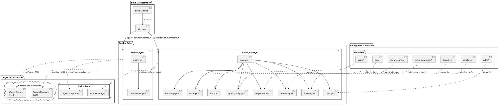
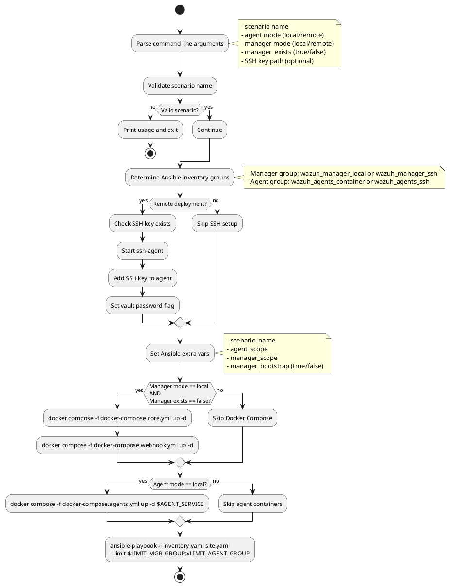
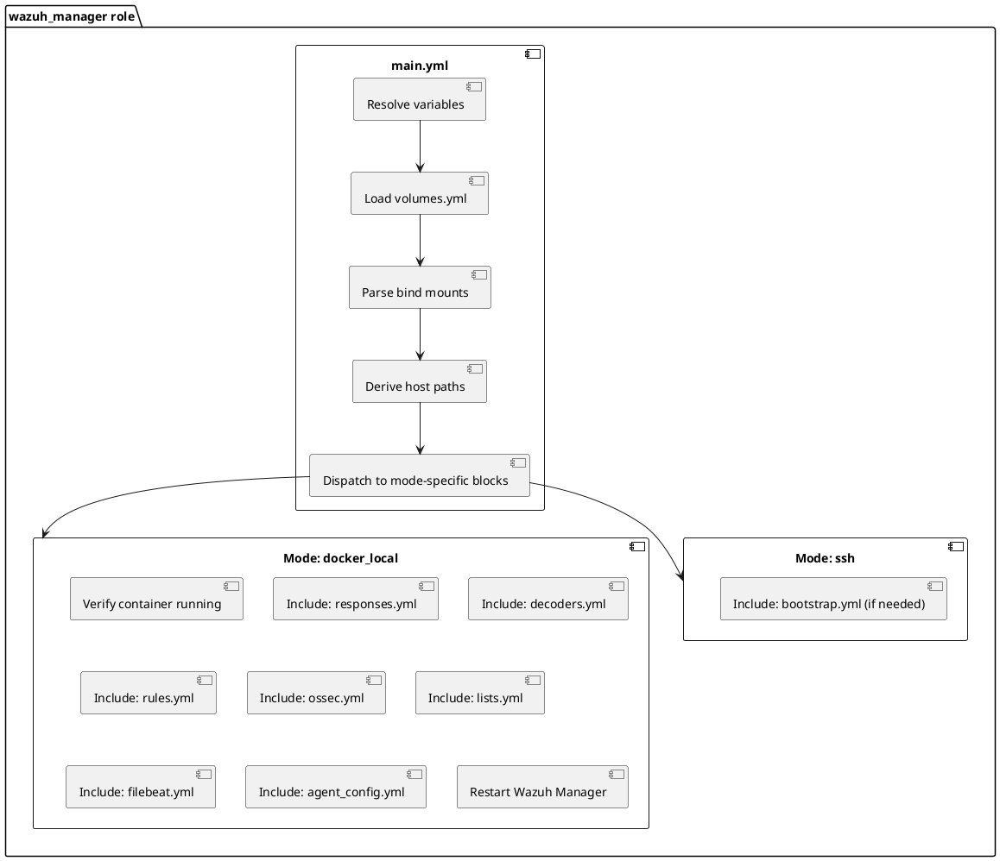
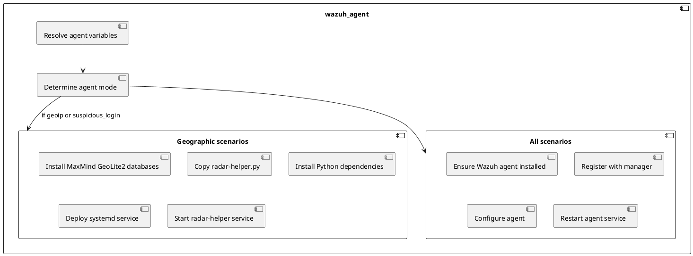

# RADAR Ansible role architecture

This document specifies the architecture and implementation of RADAR's Ansible automation framework used for deploying anomaly detection scenarios across Wazuh infrastructure.

## Architecture overview

The RADAR deployment pipeline uses Ansible to orchestrate configuration across multiple deployment modes:

- **Local development**: Docker Compose managed Wazuh manager and agents
- **Remote deployment**: SSH-based configuration of existing infrastructure
- **Hybrid deployment**: Mixed local/remote configurations

## Component hierarchy



## Build script architecture (build-radar.sh)

### Command-line interface

```bash
build-radar.sh <scenario> --agent <local|remote> --manager <local|remote> \
  --manager_exists <true|false> [--ssh-key </path/to/key>]
```

### Deployment modes

| Mode | Manager | Agent | Manager Exists | Use Case |
|------|---------|-------|----------------|----------|
| **Lab development** | local | local | false | Local Docker Compose testing |
| **Existing deployment** | remote | remote | true | Add scenario to running cluster |
| **New deployment** | remote | remote | false | Bootstrap Wazuh then configure |
| **Hybrid** | local | remote | false | Local manager with remote agents |

### Workflow stages



## Volume-first architecture

RADAR uses a **volume-first** approach: instead of executing commands inside containers, it directly manipulates configuration files on the host filesystem via Docker bind mounts.

### Volume resolution workflow

1. **Load volumes.yml**: Parse Docker Compose volume configuration
2. **Extract bind mounts**: Identify container → host path mappings
3. **Derive host paths**: Calculate actual file locations on host
4. **Direct manipulation**: Write/modify files directly on host

### Example volume mappings

```yaml
# volumes.yml
services:
  wazuh.manager:
    volumes:
      - /radar-srv/wazuh/manager/etc:/var/ossec/etc
      - /radar-srv/wazuh/manager/active-response/bin:/var/ossec/active-response/bin
      - /radar-srv/wazuh/manager/filebeat/etc:/etc/filebeat
```

**Resolved paths**:

- Container: `/var/ossec/etc/ossec.conf` → Host: `/radar-srv/wazuh/manager/etc/ossec.conf`
- Container: `/var/ossec/active-response/bin/radar_ar.py` → Host: `/radar-srv/wazuh/manager/active-response/bin/radar_ar.py`

### Benefits

- **Idempotency**: Direct file manipulation with checksums
- **Performance**: No `docker exec` overhead
- **Debugging**: Configuration files directly accessible on host
- **Reliability**: Avoids container restart race conditions

## Ansible role: wazuh_manager

### Task breakdown



### Key tasks

#### responses.yml
- Copy `radar_ar.py` to `/var/ossec/active-response/bin/`
- Copy `ar.yaml` configuration
- Set executable permissions (750)
- Generate `active_responses.env` from environment variables

#### decoders.yml
- Copy scenario-specific XML decoders to `/var/ossec/etc/decoders/`
- Use marker-based insertion: `<!-- BEGIN RADAR {scenario} -->` / `<!-- END RADAR {scenario} -->`
- Set ownership: `root:wazuh`, permissions: `640`
- Verify XML syntax

#### rules.yml
- Copy scenario-specific XML rules to `/var/ossec/etc/rules/`
- Marker-based idempotent insertion
- Ensure unique rule IDs (e.g., 100900-100999 for GeoIP)

#### ossec.yml
- Inject localfile, command, and active_response blocks into `/var/ossec/etc/ossec.conf`
- Marker-based to prevent duplicates
- Configure log monitoring paths and intervals

#### lists.yml
- Copy whitelist files (e.g., `whitelist_countries`) to `/var/ossec/etc/lists/`
- Update list references in rules

#### filebeat.yml
- Configure ingest pipelines for data enrichment (if applicable)
- Set up index templates

#### agent_config.yml
- Inject agent-specific configuration snippets
- Target specific agent groups
- Configure centralised agent configuration in `/var/ossec/etc/shared/{group}/agent.conf`

#### bootstrap.yml (remote only, if manager_bootstrap == true)
- Install Wazuh Manager packages
- Configure initial settings
- Start services

### Idempotency mechanisms

**Marker-based insertion**:
```xml
<!-- BEGIN RADAR geoip_detection -->
<decoder name="radar_geoip">
  ...
</decoder>
<!-- END RADAR geoip_detection -->
```

**Ansible module**: `blockinfile` with `marker` parameter

**Checksums**: Compare file content before copying to avoid unnecessary restarts

## Ansible role: wazuh_agent

### Task breakdown



### Key tasks

- **RADAR Helper deployment** (geoip_detection, suspicious_login scenarios):

    - Copy `/opt/radar/radar-helper.py` to agent
    - Install `maxminddb` Python package
    - Copy GeoLite2-City.mmdb and GeoLite2-ASN.mmdb to `/usr/share/GeoIP/`
    - Deploy systemd service file
    - Enable and start service

- **Agent registration**:

    - Extract manager IP from inventory
    - Run `agent-auth` with authentication token
    - Verify registration success

## Inventory structure (inventory.yaml)

```yaml
all:
  children:
    wazuh_manager_local:
      hosts:
        localhost:
          ansible_connection: local
          manager_mode: docker_local
          manager_container_name: wazuh.manager

    wazuh_manager_ssh:
      hosts:
        wazuh-manager.example.com:
          ansible_connection: ssh
          ansible_user: admin
          manager_mode: ssh

    wazuh_agents_container:
      hosts:
        localhost:
          ansible_connection: local
          agent_mode: docker_local

    wazuh_agents_ssh:
      hosts:
        agent-01.example.com:
          ansible_connection: ssh
          ansible_user: ubuntu
          agent_mode: ssh
        agent-02.example.com:
          ansible_connection: ssh
          ansible_user: ubuntu
          agent_mode: ssh
```

### Host variables

| Variable | Purpose | Example |
|----------|---------|---------|
| `manager_mode` | Deployment mode for manager | `docker_local`, `ssh` |
| `agent_mode` | Deployment mode for agent | `docker_local`, `ssh` |
| `manager_container_name` | Docker container name (local only) | `wazuh.manager` |
| `ansible_connection` | Ansible connection type | `local`, `ssh` |
| `ansible_user` | SSH username (SSH only) | `admin`, `ubuntu` |

## Scenario configuration structure

Each scenario provides configuration artifacts in `scenarios/`:

```
scenarios/
├── decoders/
│   └── {scenario}/
│       └── *.xml
├── rules/
│   └── {scenario}/
│       └── *.xml
├── ossec/
│   └── radar-{scenario}-ossec-snippet.xml
├── active_responses/
│   ├── radar_ar.py (shared)
│   └── ar.yaml (shared)
├── lists/
│   └── whitelist_countries
├── pipelines/
│   └── {scenario}/
│       └── radar-pipeline.txt
├── agent_configs/
│   └── {scenario}/
│       └── radar-{scenario}-agent-snippet.xml
└── ingest_scripts/
    └── {scenario}/
        └── wazuh_ingest.py
```

## Execution flow summary

1. **build-radar.sh** parses arguments and validates scenario
2. **Bootstrap** (if needed): Start local Docker containers or bootstrap remote manager
3. **Ansible playbook**: Execute `site.yaml` with scenario-specific variables
4. **Manager configuration**: Apply decoders, rules, OSSEC snippets, active responses
5. **Agent configuration**: Deploy RADAR Helper (if geographic scenario)
6. **Service restarts**: Restart Wazuh Manager and agents to apply changes

## Error handling and validation

- **Pre-flight checks**: Verify SSH keys exist for remote deployments
- **Container health checks**: Retry Docker container status checks with delays
- **Bind mount validation**: Assert required volume mappings exist in volumes.yml
- **XML syntax validation**: Check decoder/rule XML before injection
- **Marker verification**: Ensure markers don't conflict with existing configuration
- **Restart coordination**: Wait for service startup before proceeding

## Security considerations

- **Ansible Vault**: Sensitive variables encrypted with `--ask-vault-pass`
- **SSH key management**: ssh-agent used for remote authentication
- **File permissions**: Active responses set to 750, configs to 640
- **Ownership**: Files owned by `root:wazuh` to prevent tampering