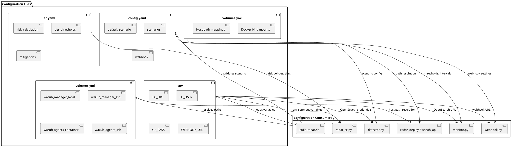

# RADAR configuration management design

This document specifies the design and structure of RADAR's configuration management system, which coordinates anomaly detection scenarios, active response policies, and deployment parameters across multiple configuration files.

## Configuration architecture



## config.yaml structure

Primary configuration file for anomaly detection scenarios.

### Schema

```yaml
default_scenario: <scenario_name>

scenarios:
  <scenario_name>:
    # Index configuration
    index_prefix: <index_prefix>
    result_index: <result_index_name>
    log_index_pattern: <pattern>
    time_field: <timestamp_field>

    # Detector configuration
    detector_interval: <minutes>
    delay_minutes: <minutes>
    categorical_field: <field_name>
    shingle_size: <integer>

    # Monitor configuration
    monitor_name: <name>
    trigger_name: <name>
    anomaly_grade_threshold: <float 0-1>
    confidence_threshold: <float 0-1>
    monitor_interval: <minutes>  # Optional: defaults to detector_interval

    # Features (RCF aggregations)
    features:
      - feature_name: <name>
        feature_enabled: <boolean>
        aggregation_query:
          <feature_name>:
            <aggregation_type>:
              field: <field_name>

    # Optional: Docker/testing
    container_name: <docker_service_name>
    container_port: <port>
    dataset_dir: <path>
    label_csv_path: <path>

webhook:
  name: <webhook_destination_name>
  url: <webhook_endpoint_url>
```

### Example: log_volume scenario

```yaml
log_volume:
  index_prefix: wazuh-ad-<scenario>-*
  result_index: opensearch-ad-plugin-result-<scenario>
  time_field: "@timestamp"
  detector_interval: <minutes>
  monitor_name: "<Scenario>-Monitor"
  anomaly_grade_threshold: <0.0-1.0>
  features:
    - feature_name: <unique_name>
      feature_enabled: true
      aggregation_query:
        <feature_name>:
          <aggregation_type>:
            field: <field_path>
```

**Full example**: See [radar/config.yaml](radar/config.yaml) for complete log_volume scenario

### Configuration parameters

| Parameter | Type | Required | Description |
|-----------|------|----------|-------------|
| `index_prefix` | string | Yes | OpenSearch index pattern for input data |
| `result_index` | string | Yes | Index name for detector results |
| `time_field` | string | Yes | Timestamp field for time series analysis |
| `detector_interval` | int | Yes | Detector execution frequency (minutes) |
| `delay_minutes` | int | Yes | Window delay for data ingestion lag (minutes) |
| `categorical_field` | string | No | High-cardinality field for per-entity baselines |
| `shingle_size` | int | No | Number of consecutive intervals in sliding window (default: 8) |
| `monitor_name` | string | Yes | OpenSearch monitor name |
| `trigger_name` | string | Yes | Monitor trigger name |
| `anomaly_grade_threshold` | float | Yes | Minimum anomaly grade to trigger (0.0-1.0) |
| `confidence_threshold` | float | Yes | Minimum confidence to trigger (0.0-1.0) |
| `features` | list | Yes | List of feature definitions (aggregations) |

### Feature definition

Each feature defines an OpenSearch aggregation for the RCF detector:

```yaml
- feature_name: <unique_identifier>
  feature_enabled: true
  aggregation_query:
    <feature_name>:  # Must match feature_name above
      <aggregation_type>:  # avg, max, sum, value_count, cardinality
        field: <field_name>
```

**Supported aggregation types**:

- `avg`: Average value
- `max`: Maximum value
- `sum`: Sum of values
- `value_count`: Count of non-null values
- `cardinality`: Count of distinct values

## ar.yaml structure

Active response configuration file defining risk calculation and mitigation policies.

### Schema

```yaml
scenarios:
  <scenario_name>:
    # Rule mappings
    ad:
      rule_ids: [<rule_ids>]
    signature:
      rule_ids: [<rule_ids>]

    # Risk weights (must sum to ~1.0)
    w_ad: <float>
    w_sig: <float>
    w_cti: <float>

    # Time windows
    delta_ad_minutes: <int>
    delta_signature_minutes: <int>

    # Signature risk parameters
    signature_impact: <float 0-1>
    signature_likelihood: <float 0-1> | <list>

    # Risk thresholds
    tiers:
      tier1_min: <float 0-1>
      tier1_max: <float 0-1>
      tier2_max: <float 0-1>

    # Response actions
    mitigations_tier2: [<action_names>]
    mitigations_tier3: [<action_names>]
    allow_mitigation: <boolean>
```

### Example: geoip_detection scenario (minimal)

```yaml
geoip_detection:
  ad:
    rule_ids: [<rule_ids>]
  signature:
    rule_ids: [<rule_ids>]
  w_ad: <0.0-1.0>
  w_sig: <0.0-1.0>
  w_cti: <0.0-1.0>
  delta_ad_minutes: <minutes>
  signature_impact: <0.0-1.0>
  signature_likelihood: <0.0-1.0>
  tiers:
    tier1_min: <threshold>
    tier1_max: <threshold>
    tier2_max: <threshold>
  mitigations_tier2: [<action_names>]
  mitigations_tier3: [<action_names>]
  allow_mitigation: <boolean>
```

**Full examples**: See [radar/scenarios/active_responses/ar.yaml](radar/scenarios/active_responses/ar.yaml)

### Configuration parameters

| Parameter | Type | Description |
|-----------|------|-------------|
| `ad.rule_ids` | list[str] | Wazuh rule IDs for anomaly detection alerts |
| `signature.rule_ids` | list[str] | Wazuh rule IDs for signature-based alerts |
| `w_ad` | float | Weight for AD component (A) in risk formula |
| `w_sig` | float | Weight for signature component (S) in risk formula |
| `w_cti` | float | Weight for CTI component (T) in risk formula |
| `delta_ad_minutes` | int | Time window for correlated AD events (minutes) |
| `delta_signature_minutes` | int | Time window for correlated signature events (minutes) |
| `signature_impact` | float | Impact score for signature alerts (0-1) |
| `signature_likelihood` | float or list | Likelihood score (0-1) or per-rule mappings |
| `tiers.tier1_min` | float | Minimum risk score for Tier 1; scores below fall into Tier 0 (0-1) |
| `tiers.tier1_max` | float | Maximum risk score for Tier 1 (0-1) |
| `tiers.tier2_max` | float | Maximum risk score for Tier 2 (0-1) |
| `mitigations_tier2` | list[str] | Mild/reversible mitigation actions executed at Tier 2 |
| `mitigations_tier3` | list[str] | Harsh/permanent mitigation actions executed at Tier 3 |
| `allow_mitigation` | bool | Whether to execute automated mitigations at Tier 2 and Tier 3 |

### Risk calculation formula

```
A = anomaly_grade × confidence
S = signature_impact × signature_likelihood
T = CTI_score (aggregated threat intelligence)

R = w_ad × A + w_sig × S + w_cti × T
```

### Tier determination

```
if R < tier1_min: Tier 0 (no actions)
elif R < tier1_max: Tier 1 (email + DECIPHER incident)
elif R < tier2_max: Tier 2 (+ mitigations_tier2 if allow_mitigation)
else: Tier 3 (+ mitigations_tier3 if allow_mitigation)
```

### Variable signature likelihood

For scenarios with multiple signature rules of varying severity:

```yaml
signature_likelihood:
  - rule_id: ["210012", "210013"]
    weight: 0.5
  - rule_id: ["210020", "210021"]
    weight: 0.5
```

## .env file structure

Environment variables for sensitive credentials and endpoints.

### Example (minimal with placeholders)

```bash
# OpenSearch/Wazuh Indexer
OS_URL=https://<hostname>:<port>
OS_USER=<username>
OS_PASS=<password>
OS_VERIFY_SSL=<true|false>

# Webhook
WEBHOOK_URL=http://<webhook_host>:<port>/notify
WEBHOOK_NAME=<webhook_name>

# DECIPHER (optional)
DECIPHER_BASE_URL=https://<decipher_host>
DECIPHER_VERIFY_SSL=<true|false>
```

**Full example**: See [radar/env.example](radar/env.example)

### Variables

| Variable | Required | Description |
|----------|----------|-------------|
| `OS_URL` | Yes | OpenSearch/Wazuh Indexer endpoint |
| `OS_USER` | Yes | OpenSearch username |
| `OS_PASS` | Yes | OpenSearch password |
| `OS_VERIFY_SSL` | No | SSL certificate verification (default: true) |
| `WEBHOOK_URL` | Yes | Webhook service endpoint for monitor notifications |
| `WEBHOOK_NAME` | No | Webhook destination name (default: "RADAR Webhook") |
| `DECIPHER_BASE_URL` | No | DECIPHER instance URL (required for CTI enrichment and FlowIntel cases) |
| `DECIPHER_VERIFY_SSL` | No | SSL certificate verification for DECIPHER (default: false) |
| `DECIPHER_TIMEOUT_SEC` | No | DECIPHER API request timeout in seconds (default: 30) |

## Deployment target resolution

RADAR does not maintain a host inventory. The manager runs locally, on the same
host as the entry-point scripts, and every manager-side operation is addressed
either through the Wazuh REST API or through the container's bind mounts.
Endpoints are not deployment targets: they self-enroll by running
`bootstrap-agent.sh`, and are thereafter addressed by agent ID through the API.

## volumes.yml structure

**Purpose**: `radar_deploy/_lib.sh` parses this file to derive host filesystem paths for direct configuration file manipulation without `docker exec`.

**Full example**: See [radar/volumes.yml](radar/volumes.yml)

## Configuration validation

### config.yaml validation

- **detector.py**: Validates scenario exists in `scenarios` section
- **detector.py**: Ensures required fields present: `time_field`, `features`, `index_prefix`
- **monitor.py**: Validates `monitor_name`, `trigger_name`, thresholds defined

### ar.yaml validation

- **radar_ar.py**: Validates scenario exists when rule ID triggered
- **radar_ar.py**: Ensures risk weights sum to approximately 1.0
- **radar_ar.py**: Validates tier thresholds are monotonically increasing

### .env validation

- **build-radar.sh**: Ensures `OS_URL` and `WEBHOOK_URL` set before execution
- **detector.py, monitor.py, webhook.py**: Validate required credentials present

## Configuration precedence

1. **Command-line arguments**: Override all other sources (e.g., `--scenario`)
2. **Environment variables**: Loaded from `.env` file
3. **config.yaml**: Scenario-specific defaults
4. **ar.yaml**: Active response policies
5. **Hard-coded defaults**: Fallback values in Python modules

## Best practices

1. **Version control**: Keep config.yaml, ar.yaml, and volumes.yml in Git
2. **Secrets management**: Never commit `.env` file; use `.env.example` template
3. **Validation**: Test configuration changes in lab environment before production
4. **Documentation**: Comment complex likelihood mappings and custom thresholds
5. **Consistency**: Keep `scenario_name` consistent across all configuration files
6. **Incremental changes**: Modify one parameter at a time for easier troubleshooting