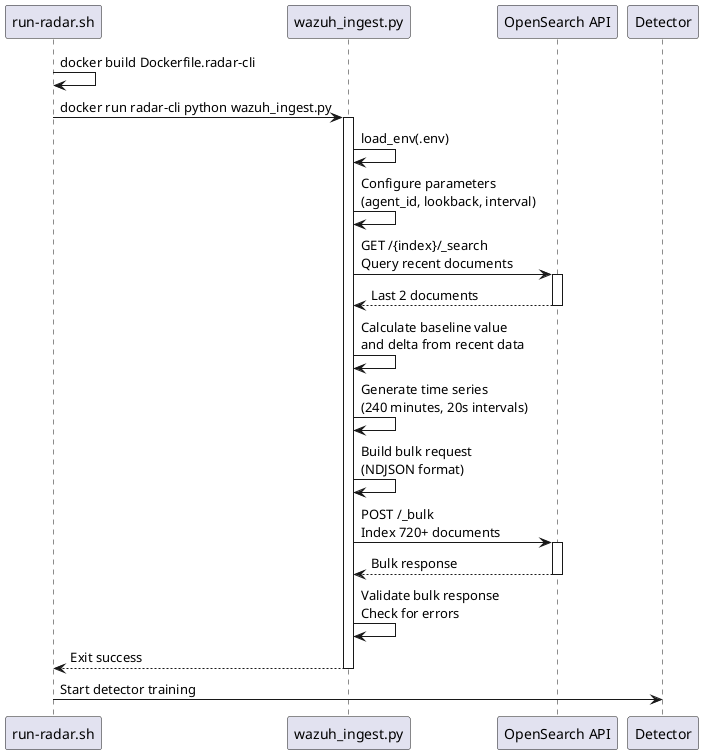

# RADAR data ingestion module design

This document specifies the design of RADAR's data ingestion modules (`wazuh_ingest.py`) that generate synthetic time-series data for training OpenSearch RCF anomaly detectors.

## Purpose

Behavior-based anomaly detection scenarios require historical baseline data to establish normal patterns. The data ingestion modules generate synthetic time-series data that:

1. Mimics realistic operational patterns
2. Provides sufficient training data (typically 240 minutes)
3. Aligns with Wazuh data schema
4. Enables immediate detector training without waiting for real data accumulation

## Architecture



## Module structure

### Common utility functions

**Required functions**:

- `load_env(env_path)`: Load environment variables from .env file
- `iso(dt)`: Convert datetime to ISO 8601 string with Z suffix
- `os_post(url, auth, verify_tls, body)`: Execute OpenSearch POST request with error handling

### Main workflow algorithm

**Processing steps**:

1. **Build radar-cli**: Create Docker image with detector/monitor/webhook tools
2. **Load configuration**: Read OS_URL, OS_USER, OS_PASS from .env
3. **Configure parameters**: Set agent_id, agent_name, lookback minutes, sampling interval
4. **Query baseline**: Retrieve recent documents for baseline calculation
5. **Calculate baseline**: Determine starting value and delta (growth rate)
6. **Generate time series**: Create synthetic documents with timestamps and values
7. **Bulk index**: Send documents to OpenSearch via Bulk API
8. **Validate**: Check bulk response for errors

## Scenario-specific implementations

### Log volume scenario

**Index**: `wazuh-ad-log-volume-*`

**Document schema**:
```json
{
  "@timestamp": "2026-02-16T10:00:00Z",
  "agent": {
    "name": "edge.vm",
    "id": "001"
  },
  "data": {
    "log_path": "/var/log",
    "log_bytes": 228654752
  },
  "predecoder": {
    "program_name": "log_volume_metric"
  }
}
```

**Baseline calculation algorithm**:

1. Query last 10 minutes for 2 most recent documents
2. Sort by @timestamp descending
3. Extract metric values from both documents
4. Calculate delta (growth rate): `delta = value1 - value2`
5. Use fallback delta (e.g., 20000) if insufficient data

**Time series generation algorithm**:

1. Calculate total points: `(lookback_minutes * 60) / step_seconds`
2. Calculate start value: `first_value - delta * (total_points - 1)`
3. For each point i:
   - Timestamp: `start_time + (i * step_seconds)`
   - Value: `start_value + delta * i`
   - Create document with timestamp, agent info, and metric value

**Characteristics**:

- Linear growth pattern
- Monotonically increasing values
- Realistic byte count magnitudes
- 20-second sampling intervals

### Suspicious login scenario

**Index**: `wazuh-ad-suspicious-login-*`

**Document schema** (varies by implementation):
```json
{
  "@timestamp": "2026-02-16T10:00:00Z",
  "agent": {"name": "edge.vm"},
  "data": {
    "srcuser": "alice",
    "srcip": "192.168.1.10"
  },
  "rule": {"id": "5715", "level": 3}
}
```

**Baseline calculation**:
- Query authentication frequency patterns
- Calculate average session intervals
- Determine normal user login counts per hour

## Bulk indexing

### NDJSON format specification

OpenSearch Bulk API requires newline-delimited JSON format:

- Each document requires two lines:

    1. Action metadata: `{"index": {"_index": "<index_name>"}}`
    2. Document source: `{"@timestamp": "...", "agent": {...}, "data": {...}}`

- Lines separated by `\n`
- Payload must end with `\n`

### Bulk request construction algorithm

1. Initialize empty lines array
2. For each document:

   - Append action metadata line (JSON)
   - Append document source line (JSON)

3. Join lines with newline separator
4. Append final newline
5. POST to `{os_url}/_bulk` with:

   - Content-Type: `application/x-ndjson`
   - Basic authentication
   - Timeout: 30 seconds

### Batch size considerations

- **Default**: 500-1000 documents per bulk request
- **Log volume scenario**: ~720 documents (240 minutes × 3 points/minute)
- **Trade-offs**: Larger batches reduce network overhead but increase memory usage

## Error handling requirements

### Connection errors

- Check HTTP status code
- Accept only 200 or 201 responses
- Raise error with status code and response text on failure

### Bulk response validation

- Parse JSON response
- Check for `errors` field
- Iterate through `items` array
- Log any item containing `error` field
- Exit with non-zero status if errors found

### Configuration validation

- Verify OS_URL, OS_USER, OS_PASS are set
- Log missing variables to stderr
- Exit with status 2 if configuration incomplete

## Configuration parameters

| Parameter | Type | Default | Description |
|-----------|------|---------|-------------|
| `minutes` | int | 240 | Historical data lookback period (minutes) |
| `step_s` | int | 20 | Time interval between data points (seconds) |
| `agent_id` | str | "001" | Wazuh agent ID |
| `agent_name` | str | "edge.vm" | Wazuh agent name |
| `index_pattern` | str | Scenario-specific | OpenSearch index pattern |
| `fallback_delta` | int | 20000 | Default growth rate if baseline query fails |

## Execution

### Via run-radar.sh

```bash
docker run --rm --network host \
  --env-file .env \
  -v "$(pwd)/scenarios:/app/scenarios" \
  radar-cli:latest \
  python /app/scenarios/ingest_scripts/log_volume/wazuh_ingest.py
```

### Standalone execution

```bash
cd radar
python scenarios/ingest_scripts/log_volume/wazuh_ingest.py
```

### Prerequisites

- `.env` file with OpenSearch credentials
- OpenSearch/Wazuh Indexer accessible
- Target index exists (or auto-create enabled)
- Python packages: `requests`

## Integration with detector workflow

Sequence in `run-radar.sh`:

1. **Ingestion**: Execute `wazuh_ingest.py` to populate index
2. **Wait period**: Allow time for indexing to complete (e.g., 10 seconds)
3. **Detector creation**: Create OpenSearch AD detector pointing to index
4. **Training**: Detector trains on synthetic historical data
5. **Real-time detection**: Detector begins evaluating real incoming data

## Implementation references

**Primary implementations**:

- [radar/scenarios/ingest_scripts/log_volume/wazuh_ingest.py](radar/scenarios/ingest_scripts/log_volume/wazuh_ingest.py)
- [radar/scenarios/ingest_scripts/suspicious_login/wazuh_ingest.py](radar/scenarios/ingest_scripts/suspicious_login/wazuh_ingest.py)

**Execution scripts**:

- [radar/run-radar.sh](radar/run-radar.sh) - Orchestrates ingestion workflow

## Best practices

1. **Realistic patterns**: Generate data that mimics actual system behavior
2. **Sufficient volume**: Ensure enough data points for RCF training (minimum ~100 points)
3. **Timestamp accuracy**: Use precise timestamps to avoid detection gaps
4. **Schema consistency**: Match exact field names and types expected by detector
5. **Index naming**: Follow Wazuh index naming conventions with date suffixes
6. **Error validation**: Check bulk response for partial failures
7. **Idempotency**: Support re-running ingestion without duplicates (use unique IDs if needed)