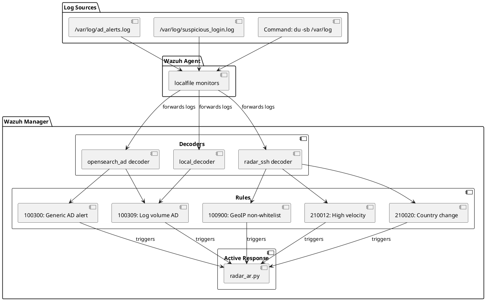

# RADAR custom rule and decoder patterns

This document specifies the design patterns for RADAR's custom Wazuh decoders and rules that enable anomaly detection integration and geographic anomaly detection.

## Architecture overview



## Decoder patterns

### OpenSearch AD decoder

**Purpose**: Extract anomaly grade, confidence, and entity from webhook-generated AD alerts

**File**: `scenarios/decoders/log_volume/100-opensearch_ad-decoders.xml`

```xml
<decoder name="opensearch_ad">
  <prematch>^opensearch_ad:</prematch>
</decoder>

<decoder name="opensearch_ad_child">
  <parent>opensearch_ad</parent>
  <regex offset="after_parent">entity="(\.*?)"</regex>
  <order>entity</order>
</decoder>

<decoder name="opensearch_ad_child">
  <parent>opensearch_ad</parent>
  <regex offset="after_parent">grade="(\.*?)"</regex>
  <order>anomaly_grade</order>
</decoder>

<decoder name="opensearch_ad_child">
  <parent>opensearch_ad</parent>
  <regex offset="after_parent">confidence="(\.*?)"</regex>
  <order>anomaly_confidence</order>
</decoder>
```

**Extracted fields**:

- `entity`: Agent name or entity identifier from high-cardinality field
- `anomaly_grade`: Anomaly score (0.0-1.0)
- `anomaly_confidence`: Model confidence (0.0-1.0)

**Example log line**:
```
Feb 16 10:30:15 wazuh-manager opensearch_ad: LogVolume-Growth-Detected entity="edge.vm" grade="0.85" confidence="0.92"
```

### RADAR SSH decoder (enriched authentication logs)

**Purpose**: Extract geographic enrichment fields from RADAR Helper

**File**: `scenarios/decoders/suspicious_login/100-radar-ssh-decoders.xml`

```xml
<decoder name="radar_ssh">
  <prematch>RADAR outcome</prematch>
</decoder>

<decoder name="radar_ssh_outcome">
  <parent>radar_ssh</parent>
  <regex offset="after_parent">outcome='(\w+)'</regex>
  <order>radar_outcome</order>
</decoder>

<decoder name="radar_ssh_country">
  <parent>radar_ssh</parent>
  <regex offset="after_parent">country='(\w*)'</regex>
  <order>radar_country</order>
</decoder>

<decoder name="radar_ssh_geo_velocity">
  <parent>radar_ssh</parent>
  <regex offset="after_parent">geo_velocity_kmh='([\d.]+)'</regex>
  <order>radar_geo_velocity_kmh</order>
</decoder>

<decoder name="radar_ssh_country_change">
  <parent>radar_ssh</parent>
  <regex offset="after_parent">country_change_i='(\d)'</regex>
  <order>radar_country_change_i</order>
</decoder>

<decoder name="radar_ssh_asn_novelty">
  <parent>radar_ssh</parent>
  <regex offset="after_parent">asn_novelty_i='(\d)'</regex>
  <order>radar_asn_novelty_i</order>
</decoder>
```

**Extracted fields**:

- `radar_outcome`: "success" or "failure"
- `radar_country`: ISO 3166-1 alpha-2 country code
- `radar_geo_velocity_kmh`: Geographic velocity (km/h)
- `radar_country_change_i`: Binary indicator (0/1)
- `radar_asn_novelty_i`: Binary indicator (0/1)

### Local decoder (command output)

**Purpose**: Extract structured data from command outputs

**File**: `scenarios/decoders/log_volume/local_decoder.xml`

```xml
<decoder name="local_decoder">
  <prematch>^\d+\s+</prematch>
</decoder>

<decoder name="local_log_bytes">
  <parent>local_decoder</parent>
  <regex>^(\d+)</regex>
  <order>log_bytes</order>
</decoder>
```

**Example log line**:
```
228654752	/var/log
```

**Extracted field**: `log_bytes`: Integer byte count

## Rule patterns

### Generic OpenSearch AD alert rule

**Rule ID**: 100300

**Purpose**: Match all OpenSearch AD alerts for logging/aggregation

```xml
<rule id="100300" level="5">
  <decoded_as>opensearch_ad</decoded_as>
  <description>Generic OpenSearch AD Alert</description>
  <group>anomaly_detection,opensearch_ad</group>
</rule>
```

### Scenario-specific AD rule

**Rule ID**: 100309 (Log Volume)

**Purpose**: Match specific AD scenario by trigger name

```xml
<rule id="100309" level="10">
  <if_sid>100300</if_sid>
  <match>LogVolume-Growth-Detected</match>
  <description>OpenSearch AD: Abnormal log volume growth detected on $(entity)</description>
  <group>anomaly_detection,log_volume,opensearch_ad</group>
</rule>
```

### GeoIP signature-based rule (list-based)

**Rule ID**: 100900

**Purpose**: Detect authentication from non-whitelisted countries using CDB list

```xml
<rule id="100900" level="10">
  <if_sid>5715</if_sid>  <!-- SSH authentication success -->
  <list field="radar_country" lookup="not_match_key">/var/ossec/etc/lists/whitelist_countries</list>
  <description>SSH connection from non-whitelisted country: $(radar_country) by user $(radar_user) from $(radar_src_ip)</description>
  <group>authentication_success,geoip_detection</group>
</rule>
```

**List file** (`/var/ossec/etc/lists/whitelist_countries`):
```
US
CA
GB
DE
FR
JP
...
```

### GeoIP signature-based rule (hardcoded fallback)

**Rule ID**: 100901

**Purpose**: Hardcoded whitelist as fallback

```xml
<rule id="100901" level="10">
  <if_sid>5715</if_sid>
  <field name="srcgeoip" negate="yes">^AT$|^BE$|^BG$|^HR$|^CY$|^CZ$|^DK$|^EE$|^FI$|^FR$|^DE$|^GR$|^HU$|^IE$|^IT$|^LV$|^LT$|^LU$|^MT$|^NL$|^PL$|^PT$|^RO$|^SK$|^SI$|^ES$|^SE$|^GB$|^US$|^CA$</field>
  <description>Connection from a non-EU/US/CA country</description>
  <group>authentication_success,geoip_detection</group>
</rule>
```

### Geographic velocity rule

**Rule ID**: 210012

**Purpose**: Detect impossible travel (> 900 km/h)

```xml
<rule id="210012" level="10">
  <decoded_as>radar_ssh</decoded_as>
  <field name="radar_geo_velocity_kmh" type="pcre2">^([9]\d{2}|[1-9]\d{3,})</field>
  <description>Suspicious login: Impossible travel detected for user $(srcuser) - velocity $(radar_geo_velocity_kmh) km/h from $(srcip)</description>
  <group>authentication,suspicious_login,impossible_travel</group>
</rule>
```

**Regex explanation**: `^([9]\d{2}|[1-9]\d{3,})`

- `[9]\d{2}`: 900-999 km/h
- `[1-9]\d{3,}`: 1000+ km/h

### Country change rule

**Rule ID**: 210020

**Purpose**: Detect login from different country than previous

```xml
<rule id="210020" level="8">
  <decoded_as>radar_ssh</decoded_as>
  <field name="radar_country_change_i">^1$</field>
  <description>Suspicious login: Country change detected for user $(srcuser) - now in $(radar_country) from $(srcip)</description>
  <group>authentication,suspicious_login,country_change</group>
</rule>
```

## Field extraction patterns

### Regex patterns

| Pattern | Matches | Example |
|---------|---------|--------|
| `entity="(\.*?)"` | Quoted string | `entity="edge.vm"` |
| `grade="(\.*?)"` | Decimal number | `grade="0.85"` |
| `outcome='(\w+)'` | Single-quoted word | `outcome='success'` |
| `geo_velocity_kmh='([\d.]+)'` | Decimal with dot | `geo_velocity_kmh='450.23'` |
| `^(\d+)` | Leading integer | `228654752` |

### Field types

**Numeric comparison**:
```xml
<field name="radar_geo_velocity_kmh" type="pcre2">^([9]\d{2}|[1-9]\d{3,})</field>
```

**Exact match**:
```xml
<field name="radar_country_change_i">^1$</field>
```

**List lookup**:
```xml
<list field="radar_country" lookup="not_match_key">/path/to/list</list>
```

## Rule hierarchy

```
100300 (Generic AD alert, level 5)
└── 100309 (Log volume specific, level 10)

5715 (SSH auth success, built-in)
└── 100900 (GeoIP non-whitelist, level 10)
└── 100901 (GeoIP hardcoded, level 10)

radar_ssh (decoder parent)
└── 210012 (High velocity, level 10)
└── 210020 (Country change, level 8)
└── 210021 (ASN novelty, level 7)
```

## Deployment via Ansible

### Decoder installation

```yaml
- name: Copy decoders
  copy:
    src: "{{ decoders_src_dir }}/{{ item }}"
    dest: "{{ _host_decoders_dir }}/{{ item }}"
    owner: root
    group: wazuh
    mode: '0640'
  loop:
    - 100-opensearch_ad-decoders.xml
    - 100-radar-ssh-decoders.xml
```

### Rule installation

```yaml
- name: Inject rules with markers
  blockinfile:
    path: "{{ _host_rules_dir }}/local_rules.xml"
    marker: "<!-- {mark} RADAR {{ scenario_name }} -->"
    block: "{{ lookup('file', rules_src_dir + '/rules.xml') }}"
    owner: root
    group: wazuh
    mode: '0640'
```

### List installation

```yaml
- name: Copy whitelist
  copy:
    src: "{{ whitelist_src }}"
    dest: "/var/ossec/etc/lists/whitelist_countries"
    owner: root
    group: wazuh
    mode: '0640'
```

## Best practices

1. **Unique rule IDs**: Reserve ID ranges per scenario (e.g., 100900-100999 for GeoIP, 210000-210099 for suspicious login)
2. **Descriptive messages**: Include extracted field values in rule descriptions using `$(field_name)`
3. **Appropriate severity**: Use level 10 for high-confidence anomalies, 7-8 for medium
4. **Group tags**: Tag rules with scenario groups for filtering and aggregation
5. **Parent-child decoders**: Use parent decoder for prematch, child decoders for field extraction
6. **Regex anchors**: Use `^` and `$` to ensure precise field matching
7. **Marker-based injection**: Use Ansible blockinfile markers to enable idempotent updates