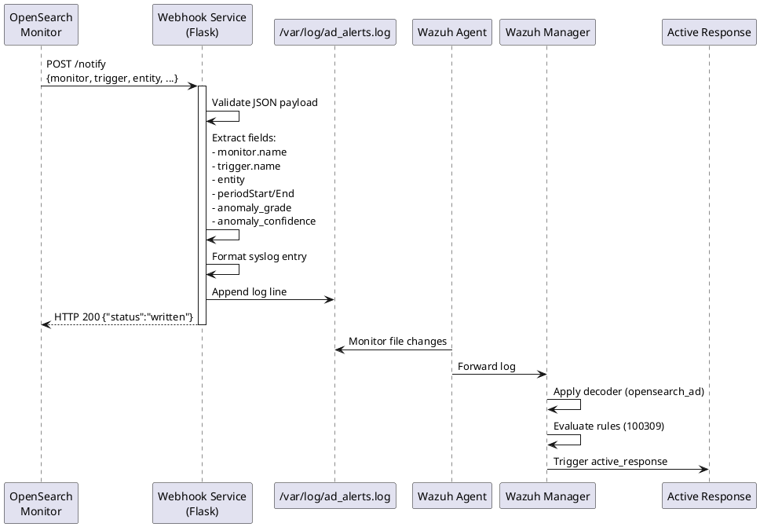

# RADAR webhook service design

This document specifies the design of RADAR's webhook service (`ad_alerts_webhook.py`) that receives OpenSearch monitor notifications and writes them to Wazuh-monitored log files.

## Purpose

The webhook service bridges OpenSearch AD monitors with Wazuh's rule engine by:

1. Receiving HTTP POST notifications from OpenSearch monitors
2. Extracting anomaly details from monitor payloads
3. Formatting alerts as syslog entries
4. Writing to log files monitored by Wazuh agent
5. En abling Wazuh rules to trigger active responses

## Architecture



## Flask application structure

### Route handler specification

**Endpoint**: `/notify`
**Method**: POST
**Content-Type**: application/json

**Behavior**:

1. Parse incoming JSON payload from OpenSearch monitor
2. Extract required fields: monitor name, trigger name, entity, period timestamps, anomaly scores
3. Format fields as syslog-compatible log entry
4. Append formatted entry to monitored log file
5. Return success response with HTTP 200

**Error handling**:

- Invalid JSON → HTTP 400
- Missing fields → Use default values ("UnknownMonitor", "UnknownTrigger", empty string)
- File I/O errors → HTTP 500 (optional explicit handling)

## Request/response specification

### Request format

**Method**: POST

**Endpoint**: `/notify`

**Headers**:
```
Content-Type: application/json
```

**Body** (JSON):
```json
{
  "monitor": {
    "name": "LogVolume-Monitor"
  },
  "trigger": {
    "name": "LogVolume-Growth-Detected"
  },
  "entity": "edge.vm",
  "periodStart": "2026-02-16T10:25:00Z",
  "periodEnd": "2026-02-16T10:30:00Z",
  "anomaly_grade": "0.85",
  "anomaly_confidence": "0.92"
}
```

### Response format

**Success** (HTTP 200):
```json
{
  "status": "written"
}
```

**Error** (HTTP 400):
```json
{
  "error": "invalid JSON"
}
```

## Log output format

### Template

```
{timestamp} {hostname} ad_alert: OpenSearchAD {trigger_name}: entity="{entity}", start="{periodStart}", end="{periodEnd}", anomaly_grade="{grade}", anomaly_confidence="{confidence}"
```

### Example output

```
Feb 16 10:30:15 wazuh-manager ad_alert: OpenSearchAD LogVolume-Growth-Detected: entity="edge.vm", start="2026-02-16T10:25:00Z", end="2026-02-16T10:30:00Z", anomaly_grade="0.85", anomaly_confidence="0.92"
```

### Field mapping

| Payload field | Log field | Example |
|---------------|-----------|--------|
| `trigger.name` | Trigger name | `LogVolume-Growth-Detected` |
| `entity` | `entity` | `edge.vm` |
| `periodStart` | `start` | `2026-02-16T10:25:00Z` |
| `periodEnd` | `end` | `2026-02-16T10:30:00Z` |
| `anomaly_grade` | `anomaly_grade` | `0.85` |
| `anomaly_confidence` | `anomaly_confidence` | `0.92` |

## Deployment

### Docker deployment

The webhook service can be deployed as a Docker container with:

- Base image: Python 3.10 slim
- Dependencies: Flask, Gunicorn
- Exposed port: 8080
- Volume mount: `/var/log` for log file access
- Restart policy: unless-stopped

**Reference**: See [radar/webhook/Dockerfile](../../radar/webhook/Dockerfile) and [docker-compose.webhook.yml](../../docker-compose.webhook.yml)

### Standalone deployment (systemd)

The service can run as a systemd unit with:

- User: root (for log file write access)
- Working directory: `/opt/radar/webhook`
- Exec command: Gunicorn binding to `0.0.0.0:8080`
- Restart policy: on-failure with 5-second delay

**Service start**:
```bash
systemctl daemon-reload
systemctl enable ad-webhook
systemctl start ad-webhook
```

## Production considerations

### WSGI server (Gunicorn)

Flask's built-in server is not production-ready. Production deployment should use Gunicorn with:

- **Workers**: 2-4 for typical AD monitoring workloads
- **Timeout**: 30 seconds (webhook writes are fast)
- **Logging**: Separate access and error log files

### File permissions

Log file must be writable by webhook service:
```bash
touch /var/log/ad_alerts.log
chown root:root /var/log/ad_alerts.log
chmod 644 /var/log/ad_alerts.log
```

### Log rotation schema

Configuration in `/etc/logrotate.d/ad_alerts`:

- Rotation: Daily
- Retention: 7 days
- Compression: Enabled (delayed by 1 day)
- Post-rotation: Reload webhook service

## Error handling

### Invalid JSON

Requests with invalid JSON payloads receive HTTP 400 response.

### Missing fields

Missing fields are handled gracefully using default values:

- Monitor name → "UnknownMonitor"
- Trigger name → "UnknownTrigger"
- Entity → empty string
- Timestamps → empty string
- Anomaly scores → empty string

### File I/O errors

File write failures can optionally return HTTP 500 with error message.

## Integration with Wazuh

### Wazuh agent configuration

**ossec.conf snippet**:

```xml
<localfile>
  <log_format>syslog</log_format>
  <location>/var/log/ad_alerts.log</location>
</localfile>
```

### Decoder application

Wazuh manager applies `opensearch_ad` decoder to extract:

- `entity`
- `anomaly_grade`
- `anomaly_confidence`

### Rule triggering

Extracted fields enable rule matching (e.g., rule 100309 for log volume scenario)

## Testing

### Manual test with curl

```bash
curl -X POST http://localhost:8080/notify \
  -H "Content-Type: application/json" \
  -d '{
    "monitor": {"name": "Test-Monitor"},
    "trigger": {"name": "Test-Trigger"},
    "entity": "test-entity",
    "periodStart": "2026-02-16T10:00:00Z",
    "periodEnd": "2026-02-16T10:05:00Z",
    "anomaly_grade": "0.95",
    "anomaly_confidence": "0.98"
  }'
```

**Expected response**:
```json
{"status":"written"}
```

**Verify log**:
```bash
tail -n 1 /var/log/ad_alerts.log
```

### Integration test

1. Start webhook service
2. Create OpenSearch monitor with webhook destination
3. Trigger anomaly (or use synthetic data)
4. Verify monitor sends notification
5. Check log file for entry
6. Verify Wazuh rule triggers

## Configuration summary

| Setting | Value | Description |
|---------|-------|-------------|
| **Host** | `0.0.0.0` | Listen on all interfaces |
| **Port** | `8080` | HTTP port for webhook endpoint |
| **Endpoint** | `/notify` | Webhook notification receiver |
| **Log file** | `/var/log/ad_alerts.log` | Output log file monitored by Wazuh |
| **Method** | POST | HTTP method for notifications |
| **Content-Type** | application/json | Request payload format |

## Security considerations

1. **Network isolation**: Run webhook on management network, not public internet
2. **Authentication**: Add API key validation if needed (not implemented in basic version)
3. **Rate limiting**: Consider adding rate limits to prevent DoS
4. **Input validation**: Sanitize inputs to prevent log injection attacks
5. **HTTPS**: Use reverse proxy (nginx) with TLS for production

## Implementation

See [radar/webhook/ad_alerts_webhook.py](../../radar/webhook/ad_alerts_webhook.py) for complete implementation.