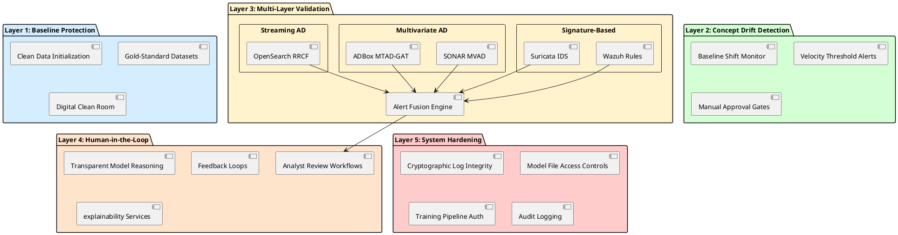
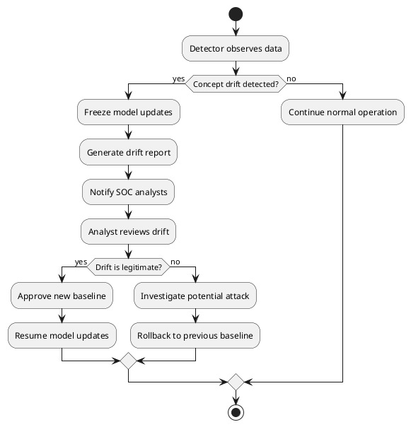

# RADAR model security and adversarial defense implementation

This document specifies RADAR's defensive mechanisms against adversarial machine learning attacks targeting anomaly detection systems.

## Defense architecture

RADAR implements a **defense-in-depth** strategy with five protective layers:



## Layer 1: Baseline protection

### Clean data initialization

**Implementation**:
```yaml
# ar.yaml configuration
baseline_init:
  use_gold_standard: true
  clean_period_start: "2026-01-01T00:00:00Z"
  clean_period_end: "2026-01-15T00:00:00Z"
  excluded_hosts: ["suspected-compromised-01"]
  verification_method: "manual_review"
```

**Process**:

1. **Identify clean period**: Select time range with no known security incidents
2. **Honeypot analysis**: Ensure no attacker presence during period
3. **Manual verification**: SOC analysts review and approve baseline data
4. **Gold-standard snapshot**: Export verified baseline for future reference

**Detector initialization logic**:

1. Check if `use_gold_standard` is enabled in config
2. If enabled:

   - Load gold-standard dataset for configured clean period
   - Exclude any compromised hosts from baseline
   - Train detector on verified clean data
   - Log detector ID and initialization status

### Digital clean room exercises

**Purpose**: Establish pristine baselines by temporarily isolating systems

**Procedure**:

1. Schedule maintenance window
2. Isolate network segment from potential attackers
3. Run systems in clean state (fresh OS, verified binaries)
4. Collect baseline data (1-2 weeks)
5. Export and preserve as gold-standard
6. Return to normal operations

## Layer 2: Concept drift detection

### Baseline shift monitoring

**Drift detection algorithm**:

**Inputs**:

- `current_stats`: Recent window statistics (mean, variance)
- `historical_stats`: Historical baseline statistics
- `threshold`: Maximum allowed shift ratio (default: 0.2 or 20%)

**Algorithm**:

1. Calculate mean shift: $\text{mean\_shift} = \frac{|\mu_{\text{current}} - \mu_{\text{historical}}|}{\mu_{\text{historical}}}$
2. Calculate variance shift: $\text{var\_shift} = \frac{|\sigma^2_{\text{current}} - \sigma^2_{\text{historical}}|}{\sigma^2_{\text{historical}}}$
3. If mean_shift > threshold OR var_shift > threshold:
   - Log warning with shift values
   - Return True (drift detected)
4. Else: Return False (no drift)

**Monitoring metrics**:

- **Mean shift**: Change in average feature values
- **Variance shift**: Change in data distribution spread
- **Distribution shape**: Kolmogorov-Smirnov test for distribution changes
- **Correlation changes**: Feature relationship alterations

### Manual approval gates

**Workflow**:


**Manual approval workflow**:

- If drift detected:

    - Freeze automatic baseline updates (set mode to "manual")
    - Generate drift report with current vs. historical statistics
    - Create case in SOAR platform with title "Concept Drift Detected"
    - Notify SOC analysts for review

- Analyst reviews drift:

    - If legitimate (e.g., infrastructure change): Approve new baseline, resume updates
    - If suspicious: Investigate potential attack, rollback to previous baseline

        ```
        severity="medium",
        required_action="baseline_approval"
        ```

## Layer 3: Multi-layer validation

### Hybrid detection approach

RADAR combines three detection methods for resilience:

| Layer | Technology | Attack Resilience | False Positive Rate |
|-------|------------|-------------------|--------------------|
| **Signature-based** | Wazuh rules, Suricata | High (known attacks) | Low |
| **Multivariate AD** | SONAR MVAD, ADBox MTAD-GAT | Medium (temporal correlations) | Medium |
| **Streaming AD** | OpenSearch RRCF | Medium (statistical outliers) | High |

**Fusion algorithm**:

**Inputs**:

- `signature_alerts`: Alerts from Wazuh/Suricata
- `mvad_alerts`: Alerts from SONAR MVAD or ADBox
- `rrcf_alerts`: Alerts from OpenSearch RCF

**Algorithm**:

- For each signature alert:

    - Find correlated AD alerts within time window (default: 5 minutes)
    - If matching AD alerts found:
        - Set confidence: "high"
        - Attach corroboration details
        - Tag with layers: ["signature", "anomaly_detection"]
    - Else:
        - Set confidence: "medium"
        - Tag with layers: ["signature"]
    - Append to fused alerts list

- Return fused alerts

**Result**: Multi-layer correlation increases confidence and reduces false positives

### Cross-layer correlation

**Scenario**: Detect data poisoning attempts

1. **RRCF detects anomaly**: Unusual pattern in training data
2. **Signature-based detects nothing**: Attack uses novel technique
3. **MVAD confirms**: Temporal correlations show subtle baseline shift
4. **Fusion decision**: Flag for human review due to multi-layer agreement

## Layer 4: Human-in-the-loop

### Transparent model reasoning

**SHAP value explanation algorithm**:

1. Extract SHAP feature contributions from anomaly event
2. Rank features by absolute contribution value (descending)
3. Select top 5 contributing features
4. For each feature:

    - Retrieve normal range from baseline
    - Compare actual value to normal range
    - Calculate deviation percentage

5. Generate explanation document with:

    - Timestamp and entity
    - Anomaly score
    - List of top contributing features with normal vs. actual values

**Dashboard display format**:
```
Anomaly Explanation - <entity> (<timestamp>)
Anomaly Score: <score> (<severity>)

Top Contributing Factors:
1. <feature_name>: <contribution>
   Normal: <range>, Actual: <value> (<deviation>%)
2. ...
```

### Analyst feedback loops

**Feedback collection structure**:

- `anomaly_id`: Unique anomaly identifier
- `analyst_id`: Analyst who provided feedback
- `timestamp`: Feedback submission time
- `classification`: True positive / False positive
- `attack_type`: If true positive, attack category
- `false_positive_reason`: If false positive, explanation
- `suggested_threshold`: Optional threshold adjustment

**Feedback processing logic**:

1. Store feedback record in database
2. If classified as true positive AND retraining recommended:
   - Trigger model update with anomaly labeled as "attack"
3. If false positive with threshold suggestion:
   - Queue threshold adjustment for analyst approval

## Layer 5: System hardening

### Cryptographic log integrity

**SHA-256 hashing chain algorithm**:

**Initialization**:

- Genesis hash: `"0" * 64` (64 zero characters)
- Previous hash: Genesis hash

**Append operation**:

1. Get current timestamp (ISO format)
2. Concatenate: `entry_data = timestamp | log_entry | prev_hash`
3. Compute SHA-256 hash: `entry_hash = SHA256(entry_data)`
4. Write to log: `timestamp | log_entry | prev_hash | entry_hash`
5. Update prev_hash: `prev_hash = entry_hash`

**Verification operation**:

1. Initialize prev_hash to genesis hash
2. For each line in log:
   - Parse: timestamp, entry, stored_prev_hash, stored_entry_hash
   - Recompute: `expected_hash = SHA256(timestamp | entry | stored_prev_hash)`
   - Verify: `expected_hash == stored_entry_hash` AND `stored_prev_hash == prev_hash`
   - If mismatch: Return False (integrity compromised)
   - Update: `prev_hash = stored_entry_hash`
3. Return True (integrity verified)

### Model file access controls

**File system permissions**:
```bash
# Detector models read-only for application
chown root:wazuh /var/ossec/models/*.pkl
chmod 640 /var/ossec/models/*.pkl

# Training directory restricted
chown wazuh-trainer:wazuh /var/ossec/models/training/
chmod 750 /var/ossec/models/training/
```

**Process isolation** (systemd):
```ini
[Service]
User=wazuh-detector
Group=wazuh
ReadOnlyDirectories=/var/ossec/models
PrivateTmp=true
ProtectSystem=strict
ProtectHome=true
```

### Training pipeline authentication

**API authentication workflow**:

1. Extract API key from request header: `X-API-Key`
2. Validate API key:

    - Check key exists and is valid
    - Verify required role: `model_trainer`
    - If invalid: Return 401 Unauthorized

3. Retrieve requester identity from API key
4. Create audit log entry:

    - Trainer ID
    - Source IP address
    - Timestamp
    - Training parameters

5. Execute training with signed inputs
6. Return model ID on success (200 OK)

## Adversarial attack scenarios and defenses

| Attack Type | Defense Mechanism | Detection Method |
|-------------|-------------------|------------------|
| **Data poisoning** | Gold-standard baselines, concept drift detection | Baseline shift monitor |
| **Evasion attacks** | Multi-layer validation, signature-based fallback | Alert fusion engine |
| **Model extraction** | API rate limiting, query obfuscation | Audit logs, query pattern analysis |
| **Backdoor injection** | Model file integrity checks, signed models | Cryptographic verification |
| **Training data manipulation** | Clean room initialization, manual approval | Human review of drift |

## Configuration schema

```yaml
adversarial_defense:
  baseline_protection:
    use_gold_standard: <boolean>
    clean_period_days: <integer>
    verification_required: <boolean>

  concept_drift:
    enable_monitoring: <boolean>
    mean_threshold: <0.0-1.0>
    variance_threshold: <0.0-1.0>
    require_manual_approval: <boolean>

  multi_layer_validation:
    enable_correlation: <boolean>
    correlation_window_minutes: <integer>
    min_corroborating_layers: <integer>

  human_in_loop:
    enable_explanations: <boolean>
    require_feedback: <boolean>
    feedback_threshold_alerts: <integer>

  system_hardening:
    log_integrity_hashing: <boolean>
    model_file_signing: <boolean>
    api_authentication: <boolean>
```

## Implementation references

**Primary implementations**:

- Concept drift monitoring: [radar/anomaly_detector/detector.py](radar/anomaly_detector/detector.py)
- Alert fusion: [radar/anomaly_detector/monitor.py](radar/anomaly_detector/monitor.py)
- Log integrity: Security utilities in [radar/](radar/)

**Configuration**:

- Defense policies: [radar/scenarios/active_responses/ar.yaml](radar/scenarios/active_responses/ar.yaml)