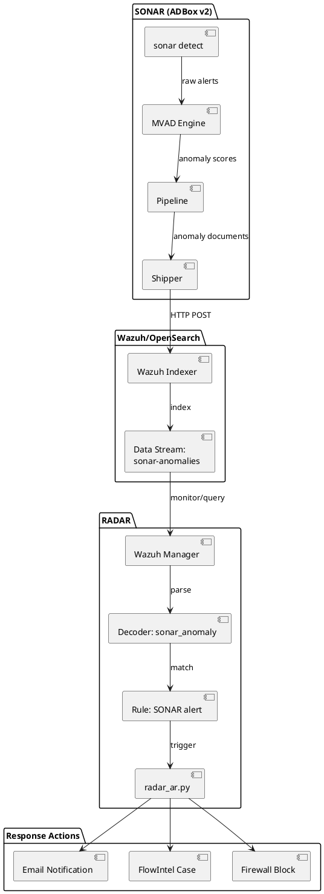

# RADAR-SONAR integration design

This document specifies the design for integrating SONAR (multivariate anomaly detection) with RADAR (automated response), enabling SONAR to ship detected anomalies to Wazuh for triggering active responses.

## Integration architecture



## Data flow

### 1. SONAR anomaly detection

**Input**: Wazuh alerts from indexer

**Processing**:
```bash
sonar detect --scenario my_scenario.yaml
```

**Output**: Anomaly scores with metadata

### 2. Anomaly document creation

**Pipeline processing specification** ([sonar/pipeline.py](sonar/pipeline.py)):

**Input**: List of `AnomalyResult` objects from MVAD engine

**Document structure**:
```json
{
  "@timestamp": "<ISO8601>",
  "sonar": {
    "scenario": "<scenario_name>",
    "model_name": "<model_name>",
    "anomaly_score": <float>,
    "severity": "<low|medium|high>",
    "is_anomaly": <boolean>,
    "interpretation": "<explanation>"
  },
  "alert": {
    "original_alert_id": "<id>",
    "rule_id": "<rule_id>",
    "rule_description": "<description>"
  },
  "agent": {"name": "<name>", "id": "<id>"},
  "data": {<original_alert_fields>}
}
```

**Conversion algorithm**:

1. For each anomaly result:

    - Extract timestamp, scenario, model info
    - Map score to severity (low/medium/high)
    - Include original alert metadata
    - Preserve agent information
    - Attach original data fields

2. Return list of documents

### 3. Shipping to Wazuh Indexer

**Shipper module specification** ([sonar/shipper/shipper.py](sonar/shipper/shipper.py)):

**Class**: `SONARShipper`

**Initialization**:

- Create OpenSearch client with:

    - Host URL from config
    - HTTP basic auth (username, password)
    - SSL verification setting

- Set index pattern (default: "sonar-anomalies")

**Shipping algorithm**:

1. Build bulk actions list:

    - For each document: Create action with `_index` and `_source`

2. Execute bulk indexing:

    - Use OpenSearch `helpers.bulk()` function
    - Set `raise_on_error=False` for partial failure handling

3. Return result:

    - `success`: Number of documents indexed successfully
    - `failed`: Number of failed documents
    - `total`: Total documents attempted

**Scenario configuration** (`sonar/scenarios/my_scenario.yaml`):
```yaml
name: "high_risk_alerts"
model_name: "mvad_high_risk_v1"

# ... detection config ...

shipping:
  enabled: true
  scenario_id: "sonar_high_risk"
  index_pattern: "sonar-anomalies"
  ship_all: false  # Only ship detected anomalies
  severity_threshold: "medium"  # Ship medium and high severity
```

### 4. Wazuh ingestion and rule matching

**Data stream template**:

Create index template for SONAR anomalies:
```json
{
  "index_patterns": ["sonar-anomalies*"],
  "template": {
    "mappings": {
      "properties": {
        "@timestamp": {"type": "date"},
        "sonar": {
          "properties": {
            "scenario": {"type": "keyword"},
            "anomaly_score": {"type": "float"},
            "severity": {"type": "keyword"},
            "is_anomaly": {"type": "boolean"}
          }
        },
        "agent": {
          "properties": {
            "name": {"type": "keyword"},
            "id": {"type": "keyword"}
          }
        }
      }
    }
  }
}
```

**Wazuh decoder** (`100-sonar-decoder.xml`):
```xml
<decoder name="sonar_anomaly">
  <prematch>\"sonar\"</prematch>
  <type>json</type>
  <plugin_decoder>JSON_Decoder</plugin_decoder>
</decoder>
```

**Wazuh rules** (`100-sonar-rules.xml`):
```xml
<!-- Generic SONAR anomaly -->
<rule id="100400" level="5">
  <decoded_as>sonar_anomaly</decoded_as>
  <field name="sonar.is_anomaly">true</field>
  <description>SONAR multivariate anomaly detected</description>
  <group>anomaly_detection,sonar</group>
</rule>

<!-- High severity SONAR anomaly -->
<rule id="100401" level="10">
  <if_sid>100400</if_sid>
  <field name="sonar.severity">high</field>
  <description>SONAR high-severity anomaly: $(sonar.scenario) on agent $(agent.name)</description>
  <group>anomaly_detection,sonar,high_severity</group>
</rule>

<!-- Scenario-specific rules -->
<rule id="100410" level="10">
  <if_sid>100400</if_sid>
  <field name="sonar.scenario">high_risk_alerts</field>
  <description>SONAR detected anomalous pattern in high-risk alerts</description>
  <group>anomaly_detection,sonar,high_risk</group>
</rule>
```

### 5. Active response integration

**ar.yaml configuration**:
```yaml
scenarios:
  sonar_high_risk:
    ad:
      rule_ids:
        - "100401"  # High-severity SONAR
        - "100410"  # High-risk scenario
    signature:
      rule_ids: []
    w_ad: 0.8
    w_sig: 0.0
    w_cti: 0.2
    delta_ad_minutes: 10
    delta_signature_minutes: 1
    signature_impact: 0.0
    signature_likelihood: 0.0
    risk_threshold: 0.51
    tiers:
      tier1_max: 0.33
      tier2_max: 0.66
    mitigations:
      - isolate_host
      - terminate_service
    create_case: true
    allow_mitigation: true
```

**Active response handling** (`radar_ar.py`):

SONAR alerts are processed like any other AD scenario:

1. **Scenario identification**: Maps rule 100410 → `sonar_high_risk`
2. **Context collection**: Queries recent alerts for affected agent
3. **Risk calculation**: Applies weights (w_ad=0.8, w_cti=0.2)
4. **Tier determination**: Based on risk score
5. **Action execution**: Tier 3 triggers mitigation + case creation

## Configuration reference

### SONAR scenario YAML (shipping section)

```yaml
shipping:
  enabled: true  # Enable shipping to RADAR
  scenario_id: "my_scenario"  # Scenario identifier for ar.yaml
  index_pattern: "sonar-anomalies"  # Target index pattern
  ship_all: false  # If false, only ship is_anomaly=true
  severity_threshold: "low"  # Minimum severity (low/medium/high)
  batch_size: 100  # Bulk indexing batch size
  flush_interval_seconds: 30  # Max time between flushes
```

### Environment variables (.env)

SONAR shipping requires OpenSearch credentials:

```bash
# Same credentials as RADAR detector/monitor
OS_URL=https://wazuh-indexer.example.com:9200
OS_USER=admin
OS_PASS=SecurePassword123
OS_VERIFY_SSL=true
```

## Deployment workflow

### 1. Deploy RADAR scenario

```bash
# Deploy RADAR with SONAR-integrated scenario
./build-radar.sh sonar_high_risk --agent remote --manager remote --manager_exists true
```

This deploys:

- SONAR decoder (100-sonar-decoder.xml)
- SONAR rules (100-sonar-rules.xml)
- Active response configuration (ar.yaml with sonar_high_risk)

### 2. Configure SONAR scenario

Create `sonar/scenarios/high_risk.yaml` with:

- Detection parameters (features, thresholds)
- Shipping configuration (enabled, scenario_id matching ar.yaml)

### 3. Run SONAR detection

```bash
# Continuous detection with shipping
sonar detect --scenario sonar/scenarios/high_risk.yaml --mode realtime
```

### 4. Verify integration

**Check SONAR shipped anomalies**:
```bash
curl -X GET "https://wazuh-indexer:9200/sonar-anomalies/_search?pretty" \
  -u admin:password \
  -H 'Content-Type: application/json' \
  -d '{
    "query": {"match_all": {}},
    "size": 10,
    "sort": [{"@timestamp": "desc"}]
  }'
```

**Check Wazuh alerts**:
```bash
# Check for rule 100410 triggers
curl -X GET "https://wazuh-indexer:9200/wazuh-alerts-*/_search?pretty" \
  -u admin:password \
  -H 'Content-Type: application/json' \
  -d '{
    "query": {"term": {"rule.id": "100410"}},
    "size": 5
  }'
```

**Check active responses**:
```bash
# Check RADAR AR logs
tail -f /var/ossec/logs/active-responses.log | grep sonar_high_risk
```

## Implementation references

**Primary implementations**:

- Anomaly document creation: [sonar/pipeline.py](sonar/pipeline.py)
- Shipper module: [sonar/shipper/shipper.py](sonar/shipper/shipper.py)
- CLI integration: [sonar/cli.py](sonar/cli.py)

**Configuration examples**:

- SONAR scenario with shipping: [sonar/scenarios/](sonar/scenarios/)
- RADAR active response: [radar/scenarios/active_responses/ar.yaml](radar/scenarios/active_responses/ar.yaml)
- Wazuh decoders/rules: [RADAR scenarios](/radar/scenarios/)

## Best practices

1. **Scenario ID consistency**: Use same `scenario_id` in SONAR shipping config and ar.yaml
2. **Severity filtering**: Set appropriate `severity_threshold` to avoid overwhelming RADAR
3. **Batch optimization**: Tune `batch_size` and `flush_interval_seconds` for performance
4. **Index lifecycle**: Configure ILM policy for sonar-anomalies index to manage retention
5. **Monitoring**: Track shipping metrics (success/failed documents)
6. **Testing**: Validate integration with synthetic anomalies before production
7. **Correlation windows**: Set `delta_ad_minutes` in ar.yaml to match SONAR detection interval