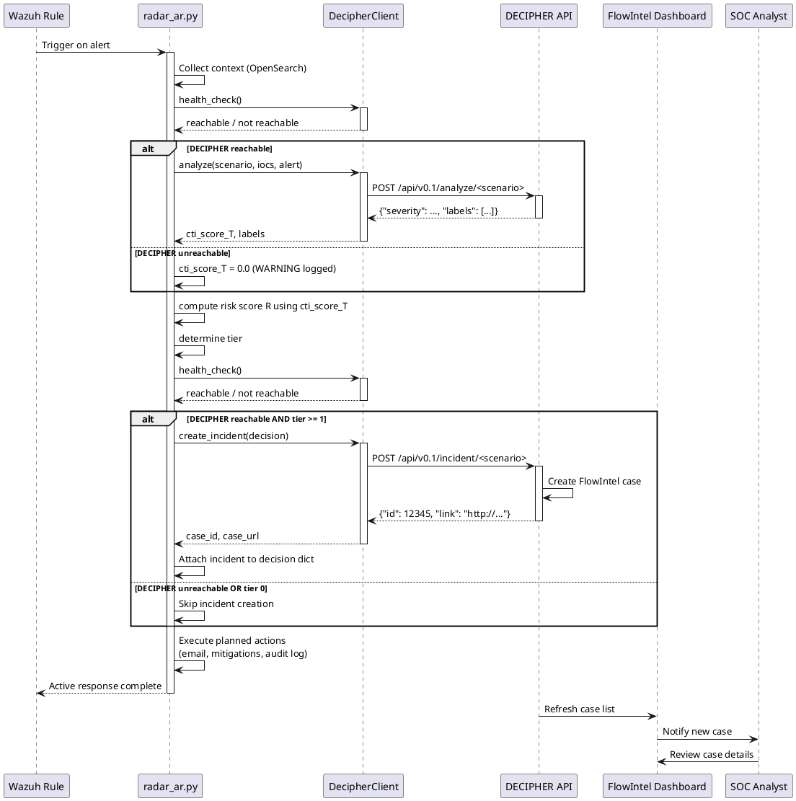
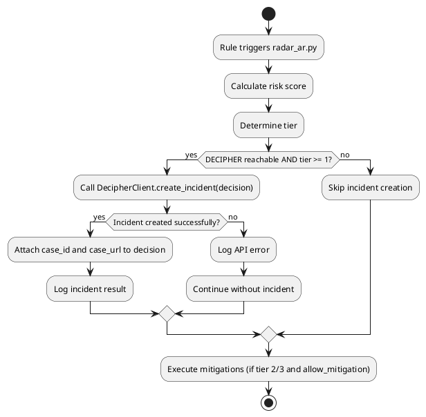

# RADAR-DECIPHER FlowIntel integration design

This document specifies the design for integrating RADAR's active response system with the SATRAP-DL DECIPHER subsystem for automated FlowIntel incident case creation and CTI enrichment.

## Integration architecture



## DECIPHER client module

**Implementation**: [radar/scenarios/active_responses/radar_ar.py](radar/scenarios/active_responses/radar_ar.py) (`DecipherClient` class)

### API contract

#### DecipherClient

**Constructor**:
```python
def __init__(self, base_url: str, verify_ssl: bool = False, timeout_sec: int = 30)
```
- Initializes HTTP session
- Configures SSL verification and timeout

**Primary interfaces**:
```python
def health_check(self) -> bool:
```
Returns `True` if DECIPHER is reachable, `False` otherwise. Called before any incident operation.

```python
def create_incident(self, decision: dict) -> dict | None:
```
Creates a FlowIntel incident case via DECIPHER. Returns result dict with `case_id` and `case_url`, or `None` on failure.

**Incident endpoints** (per scenario):

```python
INCIDENT_ENDPOINTS = {
    "suspicious_login": "/api/v0.1/incident/suspicious_login",
    "geoip_detection":  "/api/v0.1/incident/geoip_detection",
    "log_volume":       "/api/v0.1/incident/log_volume",
}
```

**Exception handling**: Failures are caught and logged; active response execution continues regardless.

## Integration with radar_ar.py

**Implementation**: [radar/scenarios/active_responses/radar_ar.py](radar/scenarios/active_responses/radar_ar.py)

### Incident creation workflow

Incident creation is triggered in `RadarActiveResponse.run()` after risk calculation, gated on two conditions:

1. DECIPHER health check passes (`DecipherClient.health_check()` returns `True`)
2. Computed tier >= 1

```python
if self.decipher.health_check() and risk["tier"] >= 1:
    incident = self.decipher.create_incident(decision)
    decision["incident"] = incident
```

This means every alert that clears Tier 0 automatically gets a FlowIntel case -- no per-scenario flag needed.

### Configuration

No scenario-level flag controls case creation. The only relevant configuration is the DECIPHER connection in the environment file.

**Environment variables (.env)**:

```bash
# DECIPHER configuration
DECIPHER_BASE_URL=https://decipher.example.com
DECIPHER_VERIFY_SSL=false
DECIPHER_TIMEOUT_SEC=30
```

## Incident creation workflow



## Incident payload

The `create_incident()` method builds the payload from the decision dict, including scenario name, risk score, tier, IOCs, and decision ID.

### Response from DECIPHER API

```json
{
  "case_id": 12345,
  "case_url": "http://flowintel.example.com/case/12345",
  "status": "open"
}
```

The `case_url` is included in the email notification sent to the SOC.

## Error handling

| Error Type | Handling Strategy |
|------------|------------------|
| **DECIPHER unreachable** | health_check returns False, skip incident creation, log warning, continue |
| **Missing DECIPHER_BASE_URL** | health_check returns False, skip silently |
| **API errors** | Log error with details, return None, continue active response |
| **Timeout** | Log timeout error, abort incident creation, continue active response |
| **Unknown scenario** | Log warning (no endpoint mapping), return None, continue |

**Design principle**: Active response execution must never be blocked by DECIPHER failures.

## Best practices

1. **Tier 1 and above**: Cases are created for all non-trivial alerts (tier >= 1), giving analysts visibility at every response level
2. **Health check first**: Always verify DECIPHER reachability before attempting incident creation
3. **Per-scenario endpoints**: Each scenario maps to its own DECIPHER incident endpoint for correct case template
4. **Error resilience**: Never block email or mitigation execution on DECIPHER failures
5. **Audit trail**: Log all incident creation attempts (success and failure) with case IDs and URLs