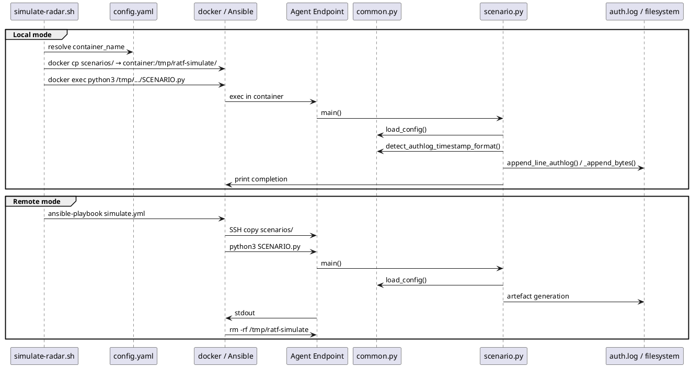

# RADAR simulation framework software design

This document specifies the design of the RADAR scenario simulation
framework, covering component structure, dispatch logic, the Ansible
playbook, the shared utility library, and all scenario-specific
simulation scripts.

## Purpose

The simulation generates agent-realistic artefacts for
validating RADAR detection scenarios end-to-end. It operates
exclusively at the agent level, writing to auth logs or the
filesystem, so that all Wazuh decoder, rule, and active response
stages are exercised under conditions identical to production.

## Module inventory

| Module | Type | Responsibility |
|--------|------|----------------|
| `simulate-radar.sh` | Bash script | Entry point, argument validation, local/remote dispatch |
| `simulate.yml` | Ansible playbook | Remote agent copy, execution, and cleanup |
| `common.py` | Python library | Shared utilities: config loading, log writing, timestamp detection |
| `suspicious_login.py` | Python script | SSH burst failure + success artefact generation |
| `geoip_detection.py` | Python script | SSH success artefact from non-whitelisted IP |
| `log_volume.py` | Python script | Exponential filesystem growth simulation |
| `config.yaml` | YAML configuration | All scenario parameters, no hardcoded values |

## Component structure
```
simulate-radar.sh
  │
  ├── [local]  config.yaml ──► container_name resolution
  │               │
  │               └──► docker exec ──► container
  │                                      └──► /tmp/ratf-simulate/scenarios/
  │                                              ├── common.py
  │                                              ├── config.yaml
  │                                              └── <scenario>.py
  │
  └── [remote] inventory.yaml ──► Ansible
                                    └──► simulate.yml
                                            └──► SSH agent endpoint
                                                   └──► /tmp/ratf-simulate/scenarios/
                                                           ├── common.py
                                                           ├── config.yaml
                                                           └── <scenario>.py
```

## Sequence diagram


---

## simulate-radar.sh

### Responsibilities
- Parse and validate `SCENARIO` and `--agent` arguments
- Resolve SSH key for remote mode
- Resolve `container_name` from `config.yaml` for local mode
- Dispatch to `docker exec` (local) or `ansible-playbook` (remote)

### Argument specification

| Argument | Required | Values | Description |
|----------|----------|--------|-------------|
| `SCENARIO` | Yes | `suspicious_login`, `geoip_detection`, `log_volume` | Scenario to simulate |
| `--agent` | Yes | `local`, `remote` | Agent execution target |
| `--ssh-key` | No | | Path to SSH private key (default: `~/.ssh/id_ed25519`) |

### Local dispatch design
```
1. python3 inline: read config.yaml[SCENARIO].container_name
   └── exit 1 if missing or empty
2. docker exec -i CONTAINER sh -lc "mkdir -p /tmp/ratf-simulate/scenarios"
3. docker cp RATF_SCENARIO_DIR/. CONTAINER:/tmp/ratf-simulate/scenarios/
4. docker exec -i CONTAINER sh -lc
       "python3 /tmp/ratf-simulate/scenarios/SCENARIO.py"
5. exit with docker exec return code
```

### Remote dispatch design
```
1. Resolve SSH_KEY path; exit 1 if file not found
2. If SSH_AUTH_SOCK unset or ssh-add -l fails:
     eval $(ssh-agent -s); ssh-add SSH_KEY
   else: ssh-add SSH_KEY if fingerprint not already loaded
3. ansible-playbook
     -i inventory.yaml
     --limit wazuh_agents_ssh
     --ask-vault-pass
     roles/wazuh_agent/playbooks/simulate.yml
     -e radar_simulate_scenario=SCENARIO
     -e ratf_scenarios_dir=RATF_SCENARIO_DIR
4. exit with ansible-playbook return code
```

### Error conditions

| Condition | Exit code | Message |
|-----------|-----------|---------|
| Missing SCENARIO | 1 | `Missing scenario argument` |
| Invalid SCENARIO | 1 | `Invalid scenario: <value>` |
| Missing --agent | 1 | `Missing --agent <local\|remote>` |
| Invalid --agent | 1 | `Invalid --agent value: <value>` |
| RATF_SCENARIO_DIR missing | 1 | `Scenario dir not found: <path>` |
| inventory.yaml missing | 1 | `Inventory not found: <path>` |
| container_name missing | 1 | `Missing '<scenario>.container_name' in config.yaml` |
| SSH key not found | 1 | `SSH key not found at: <path>` |
| Playbook missing | 1 | `Playbook not found: <path>` |

---

## simulate.yml (Ansible playbook)

### Responsibilities
- Validate input variables on remote host
- Create working directory
- Copy scenario scripts from controller to agent
- Execute selected scenario script
- Print stdout for audit trail
- Unconditionally clean up working directory

### Variable interface

| Variable | Source | Description |
|----------|--------|-------------|
| `radar_simulate_scenario` | `-e` flag | Scenario name, validated against allowed list |
| `ratf_scenarios_dir` | `-e` flag | Absolute path to scenarios dir on controller |
| `remote_workdir` | Playbook default | `/tmp/ratf-simulate` |
| `remote_scenarios_dir` | Derived | `{{ remote_workdir }}/scenarios` |

### Task sequence
```
1. assert:
     radar_simulate_scenario in [suspicious_login, geoip_detection, log_volume]
     ratf_scenarios_dir is defined

2. file: path={{ remote_scenarios_dir }} state=directory mode=0755

3. copy: src={{ ratf_scenarios_dir }}/ dest={{ remote_scenarios_dir }}/ mode=0755

4. command: python3 {{ remote_scenarios_dir }}/{{ radar_simulate_scenario }}.py
   register: sim_run

5. debug: var=sim_run.stdout

6. file: path={{ remote_workdir }} state=absent
   when: true  (unconditional)
```

### Design notes
- `become: true` is set at play level; all tasks run with privilege
  escalation.
- `gather_facts: false` reduces overhead on security-sensitive endpoints.
- Cleanup in step 6 is synchronous and removes the entire work tree.
  For `suspicious_login` and `geoip_detection`, auth log entries written
  to `/var/log/auth.log` are outside this tree and are not removed.
  For `log_volume`, the spike file is written to `target_dir` (e.g.
  `/var/log`) and is also outside this tree; it is handled separately
  by async Python-scheduled cleanup if `cleanup_minutes > 0`.

---

## common.py

### Responsibilities
- Load `config.yaml` from the directory co-located with the script
- Detect auth log timestamp format (syslog vs ISO 8601)
- Append lines to auth log via `tee` (with optional sudo)
- Format ISO timestamps with configurable timezone offset
- Parse `.env` files
- Locate repository root by walking up the directory tree

---

## suspicious_login.py

### Design
```
Parameters loaded from config.yaml:
  common.timezone_offset, common.hostname
  suspicious_login.log_path, sudo_tee, user, sshd_pid,
  fail_port, success_port,
  key_fingerprint_fail, key_fingerprint_success,
  ip_pool (list), window_seconds

Algorithm:
  step ← max(1, window_seconds // (len(ip_pool) + 1))
  base ← datetime.now()

  Phase 1 – failure burst:
    for i, ip in enumerate(ip_pool):
      ts  ← base + timedelta(seconds = i × step)
      fmt ← detect_authlog_timestamp_format(ts, tz, auth_path)
      line ← f"{fmt} {host} sshd[{pid}]: Failed password for {user}
               from {ip} port {fail_port} ssh2: {key_fail}"
      append_line_authlog(line, auth_path, sudo_tee)

  Phase 2 – success:
    ts  ← base + timedelta(seconds = min(window-1, len(ip_pool) × step))
    fmt ← detect_authlog_timestamp_format(ts, tz, auth_path)
    line ← f"{fmt} {host} sshd[{pid}]: Accepted publickey for {user}
             from {ip_pool[0]} port {success_port} ssh2: {key_ok}"
    append_line_authlog(line, auth_path, sudo_tee)
```

### Detection targets
- Rules 210012/210013: frequency ≥ 5 failures within 60 s from same
  source/destination user
- Rules 210020/210021: impossible travel when ip_pool spans multiple
  countries

### Design notes
- `step` distributes events evenly across `window_seconds` to satisfy
  the `timeframe="60"` `frequency="5"` constraints in rules 210012/210013.
- The default ip_pool contains six geographically diverse addresses
  (US, Australia, Japan, UAE, Europe), covering the impossible travel
  detection path simultaneously.
- Auth log entries are not removed by the framework and persist in
  `/var/log/auth.log` after simulation completes.

---

## geoip_detection.py

### Design
```
Parameters loaded from config.yaml:
  common.timezone_offset, common.hostname
  geoip_detection.log_path, sudo_tee, user, sshd_pid,
  success_port, ip, key_fingerprint_success

Algorithm:
  ts  ← datetime.now()
  fmt ← detect_authlog_timestamp_format(ts, tz, auth_path)
  line ← f"{fmt} {host} sshd[{pid}]: Accepted publickey for {user}
           from {ip} port {success_port} ssh2: {key_ok}"
  append_line_authlog(line, auth_path, sudo_tee)
```

### Detection targets
- Rules 100900/100901: `authentication_success` group + `radar_country`
  not in whitelist
- Default IP `8.8.8.8` resolves to US (Google), outside the
  Luxembourg/EU Greater Region whitelist

### Design notes
- A single log line is sufficient; the RADAR helper enriches it with
  `radar_country` before forwarding to the rule engine.
- Auth log entries are not removed by the framework and persist in
  `/var/log/auth.log` after simulation completes.

---

## log_volume.py

### Design
```
Parameters loaded from config.yaml:
  log_volume.target_dir, spike_filename, steps,
  start_bytes, growth_factor, sleep_seconds,
  max_total_bytes, max_step_bytes, cleanup_minutes

Helper functions:
  _int(v, default)   : safe int cast with fallback
  _float(v, default) : safe float cast with fallback
  _ensure_dir(path)  : mkdir -p equivalent
  _append_bytes(file_path, bytes_to_add, chunk=1MB):
    opens file in append+binary mode, writes in chunk-sized blocks
  _schedule_cleanup(file_path, minutes):
    Popen(["sh", "-lc",
           f"(sleep {s}; rm -f '{fp}') >/dev/null 2>&1 &"])

Main algorithm:
  spike_file ← Path(target_dir) / spike_filename
  _ensure_dir(base_dir)
  spike_file.touch() if not exists
  total_written ← 0

  for i in range(steps):
    desired_add ← int(start_bytes × (growth_factor ^ i))
    add_bytes   ← min(desired_add, max_step_bytes)
    add_bytes   ← min(add_bytes, max_total_bytes - total_written)
    if add_bytes ≤ 0: break
    _append_bytes(spike_file, add_bytes)
    total_written += add_bytes
    time.sleep(sleep_seconds)

  if cleanup_minutes > 0:
    _schedule_cleanup(spike_file, cleanup_minutes)
```

### Detection target
- Log volume metric collector measures `target_dir` size
- Growth triggers OpenSearch AD anomaly detector
- Rule 100309 (LogVolume-Growth-Detected) fires via monitor → webhook

### Safety constraints

| Parameter | Default | Purpose |
|-----------|---------|---------|
| `max_total_bytes` | 9 GB | Prevents runaway total disk consumption |
| `max_step_bytes` | 1.5 GB | Limits single-step growth burst |
| `cleanup_minutes` | 5 | Schedules async spike file removal |

### Design notes
- Cleanup is asynchronous (background shell) to avoid blocking the
  simulation script.
- On the remote Ansible path, Ansible's synchronous cleanup removes
  `/tmp/ratf-simulate` but does NOT remove the spike file, which is
  written to `target_dir` outside the work directory. If
  `cleanup_minutes` is 0, the spike file must be removed manually.


---

## config.yaml schema
```yaml
common:
  timezone_offset: str   # e.g. "+01:00"
  hostname:        str   # agent hostname used in log line host field

suspicious_login:
  log_path:                str        # path to auth.log on agent
  sudo_tee:                bool       # prepend sudo to tee command
  user:                    str        # SSH username in log lines
  sshd_pid:                int        # PID used in sshd log entries
  fail_port:               int        # source port for failure lines
  success_port:            int        # source port for success line
  key_fingerprint_fail:    str        # key field in failure lines
  key_fingerprint_success: str        # key field in success line
  ip_pool:                 list[str]  # IPs used for failure burst
  window_seconds:          int        # total event window (default 60)

geoip_detection:
  log_path:                str
  sudo_tee:                bool
  user:                    str
  sshd_pid:                int
  success_port:            int
  ip:                      str        # single non-whitelisted IP
  key_fingerprint_success: str

log_volume:
  target_dir:      str    # monitored directory (e.g. /var/log)
  spike_filename:  str    # name of generated spike file
  steps:           int    # number of growth steps
  start_bytes:     int    # bytes added in step 0
  growth_factor:   float  # exponential multiplier per step
  sleep_seconds:   float  # delay between steps
  max_total_bytes: int    # safety cap on total written
  max_step_bytes:  int    # safety cap per step
  cleanup_minutes: int    # 0 = no cleanup; >0 = async remove after N min
```