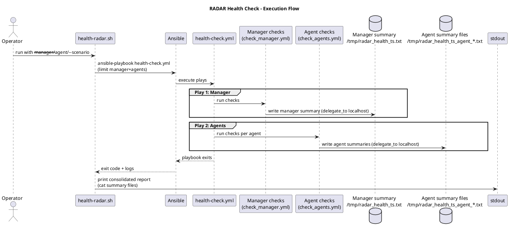

# RADAR health check software design

This document specifies the design of the RADAR deployment health check tool, covering the entry-point script, the Ansible playbook structure, and the two task files that implement manager and agent checks.

## Purpose

The health check validates that a RADAR deployment is complete and operational after `build-radar.sh` has run. It reads state from the target environment without modifying it and produces a consolidated summary report.

## Module inventory

| Module | Type | Responsibility |
|--------|------|----------------|
| `health-radar.sh` | Bash script | Entry point, argument parsing, summary display |
| `health-check.yml` | Ansible playbook | Two-play orchestrator (manager + agents) |
| `tasks/main.yml` | Ansible tasks | Manager play init, scenario resolution, summary file writer |
| `tasks/check_manager.yml` | Ansible tasks | Seven manager check groups |
| `tasks/check_agents.yml` | Ansible tasks | Four agent check groups + per-agent summary file writer |

## Component structure

```
health-radar.sh
  │
  ├── ansible-playbook health-check.yml
  │     │
  │     ├── Play 1: RADAR Health Check - Manager
  │     │     └── tasks/main.yml
  │     │           ├── init (vars, exec prefix, scenario list)
  │     │           ├── import check_manager.yml
  │     │           └── write /tmp/radar_health_<ts>.txt  [delegate_to: localhost]
  │     │
  │     └── Play 2: RADAR Health Check - Agents
  │           └── tasks/check_agents.yml
  │                 ├── 4 check groups (shell tasks)
  │                 └── write /tmp/radar_health_<ts>_agent_<host>.txt  [delegate_to: localhost]
  │
  └── (after ansible-playbook exits)
        cat /tmp/radar_health_<ts>.txt
        cat /tmp/radar_health_<ts>_agent_*.txt
```

## Entrypoint (health-radar.sh)

### Responsibilities

- Parse and validate `--manager`, `--agent`, `--scenario`, and `--ssh-key` arguments.
- Invoke `ansible-playbook health-check.yml` with resolved extra-vars including `summary_file`.
- After the playbook exits, concatenate and print the manager summary file and all per-agent summary files to stdout.

### Argument specification

| Argument | Required | Values | Default |
|----------|----------|--------|---------|
| `--manager` | Yes | `local`, `remote` | — |
| `--agent` | Yes | `local`, `remote` | — |
| `--scenario` | No | `suspicious_login`, `geoip_detection`, `log_volume`, `all` | `all` |
| `--ssh-key` | No | path | `~/.ssh/id_ed25519` |

### Manager mode mapping

| `--manager` value | `manager_mode` extra-var | Exec prefix in tasks |
|-------------------|--------------------------|----------------------|
| `local` | `docker_local` | `docker exec wazuh.manager` |
| `remote` | `docker_remote` | `docker exec wazuh.manager` (on remote host via SSH) |
| `remote` | `host_remote` | (empty — direct shell) |


## Execution flow



## Check coverage

### Manager checks

| Check group | What is verified |
|-------------|-----------------|
| Containers / service | `wazuh.manager` and `ad-webhook` containers running; Wazuh service active processes (`host_remote` mode) |
| Key files | Presence and `wazuh` group ownership of `radar_ar.py`, `ar.yaml`, `active_responses.env`, `ossec.conf`, `agent.conf` |
| Decoders and rules | Per-scenario decoder and rule files present under `/var/ossec/etc/`; `wazuh` group ownership |
| Python dependencies | `python3`, `pyyaml`, `requests` available in the manager execution environment |
| Connectivity | OpenSearch cluster health; Wazuh API authentication; Webhook endpoint reachable |
| log_volume specific | Filebeat archives pipeline contains `log_volume_metric` routing patch; `radar-log-volume` index template present in OpenSearch |
| geoip_detection specific | `whitelist_countries` list file present with `wazuh` group ownership |

### Agent checks

| Check group | What is verified |
|-------------|-----------------|
| Wazuh agent service | `wazuh-agentd` process running |
| RADAR helper | `radar-helper.py` present; `radar-helper.service` active; `maxminddb` importable in `/opt/radar/venv` |
| GeoIP databases | `GeoLite2-City.mmdb` and `GeoLite2-ASN.mmdb` present under `/usr/share/GeoIP/` |
| AR scripts | At least one `.sh` active response script in `/var/ossec/active-response/bin/` |

## Summary report

Summaries are written to timestamped files on the controller during playbook execution and printed by `health-radar.sh` after `ansible-playbook` exits, making the consolidated report the last visible output regardless of how many agents are checked. Each block shows only `FAIL` and `WARN` lines in the body; `OK` items are counted in the footer only.