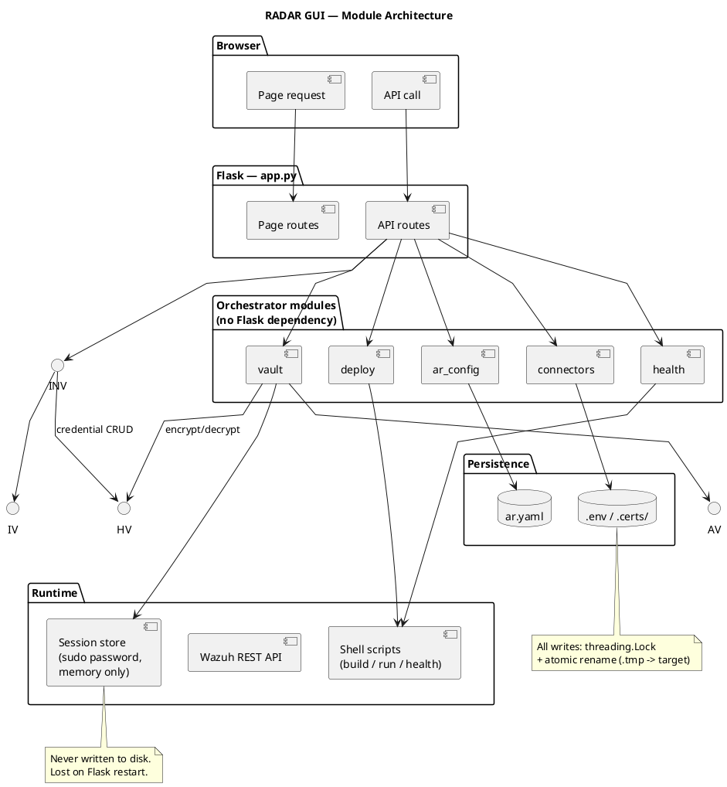

# RADAR GUI software design

This document specifies the software design of the RADAR GUI (`radar/gui/`), a Flask-based web application providing a browser interface for the full RADAR operational lifecycle. It covers the backend-to-frontend architecture, key design decisions, and the credential/session security model. Frontend component internals (HTML structure, JavaScript event wiring, CSS) are out of scope.

## Purpose and scope

The RADAR GUI replaces direct file editing and shell invocation for routine RADAR operations. It wraps `build-radar.sh`, `run-radar.sh`, `health-radar.sh` and the `radar_deploy/` scripts with a browser interface, manages `ar.yaml` through structured forms, stores connector credentials in `.env`, and holds the host `sudo` password in a session-scoped, in-memory credential store.

The interface presents three pages — **RADAR Scenarios**, **Connectors** and **Deployment**. It does not manage an Ansible inventory: RADAR deploys against the local manager's REST API, so there is no host inventory, no `host_vars/`, and no vault to unlock.

## Module structure

```
gui/
├── app.py                 Flask application: all routes and startup
├── requirements.txt       Runtime dependencies
└── orchestrator/          Backend modules — no Flask dependency
    ├── ar_config.py       Read/write ar.yaml
    ├── connectors.py      Read/write .env, live connector tests
    ├── deploy.py          Command assembly, subprocess streaming
    ├── health.py          Health-check execution
    └── vault.py           Session-scoped sudo password store
```

The orchestrator modules are deliberately kept free of Flask imports. This separation allows the file-management and subprocess logic to be tested independently and reused by CLI tooling without importing the web framework.



## Flask application: app.py

### Startup and RADAR_ROOT resolution

`app.py` resolves the RADAR root directory at import time:

```python
RADAR_ROOT = str(Path(os.environ.get("RADAR_ROOT", Path(__file__).parent.parent)).resolve())
```

The default places the root at the parent of `gui/` (i.e., the `radar/` directory). Setting the `RADAR_ROOT` environment variable before starting the server redirects all file I/O to a different installation, enabling the GUI to manage an alternate RADAR root without code changes.

The server runs with `threaded=True` so that long-running streaming responses (build output, health check output) do not block subsequent requests on the same worker.

### Route organisation

Routes are grouped into two sets: page routes and API routes.

**Page routes** (`/`, `/active-responses`, `/infrastructure`, `/connectors`, `/deploy`) render templates with data fetched from the orchestrator modules. They pass only the data needed for initial render; all subsequent interactions go through the API routes via JavaScript.

**API routes** (`/api/...`) are the stable contract between the frontend and the backend.

## Orchestrator modules

### AR configuration management: ar_config.py

Reads and writes `scenarios/active_responses/ar.yaml`. The central design decision is default-block deep-merge: `ar.yaml` contains a `scenarios.default` block that holds baseline values shared across all scenarios. `get_scenario()` loads the full file, starts with a deep copy of the default block, and merges the scenario-specific block on top. This means scenario entries in `ar.yaml` only need to store values that differ from the defaults.

`update_scenario()` applies a partial patch to the existing scenario entry using the same deep-merge logic, so the GUI can send only the changed fields rather than the full config on every save.

All writes use atomic temp-file replacement (`ar.yaml.tmp` -> `ar.yaml`) under a module-level `threading.Lock` to prevent partial writes if two browser sessions submit simultaneously.

### Privileged operation model

The GUI performs no inventory management. Operations requiring root on the GUI
host — bringing up the manager stack, minting an enrollment token, opening or
closing the enrollment window, and tearing the stack down — obtain the `sudo`
password from the session store described below and feed it to `sudo -A`
non-interactively.

Operations that act on the manager rather than the host — deploying a scenario's
ruleset, assigning agent groups, deregistering an agent, running the health
check — are performed through the Wazuh REST API and require no host privilege.

### External service credentials: connectors.py

Manages credentials and URLs in `.env` at the RADAR root. The module defines `FIELD_MAP`, a 27-entry dict mapping GUI field IDs to environment variable names, and `PASSWORD_KEYS`, a 5-entry subset mapping the five secret field IDs to their environment variable names:

```python
PASSWORD_KEYS = {
    "os-pass":         "OS_PASS",
    "wazuh-pass":      "WAZUH_AUTH_PASS",
    "dashboard-pass":  "DASHBOARD_PASS",
    "smtp-pass":       "SMTP_PASS",
    "decipher-token":  "DECIPHER_TOKEN",
}
```

The `/api/connectors/reveal` endpoint checks the incoming request body key against `set(PASSWORD_KEYS.values())` — the **environment variable names**, not the field IDs. The request must therefore send the environment variable name (e.g. `"OS_PASS"`), and the endpoint refuses any key not in that set of five values.

SSL verification fields (`*-ssl-enabled`) are handled separately from `FIELD_MAP` via a dedicated `ssl_prefix_map` in `save_connector()`: if the value is `"false"`, the corresponding `*_VERIFY_SSL` environment variable is set to `"false"`; if a CA certificate is present in the same request, its content is written to `.certs/<name>-ca.pem` (chmod 0600) and the path is stored as the environment variable value; otherwise the environment variable is set to `"true"`. Certificate content fields (`*-cert-content`) are silently skipped in the main field loop since they are consumed by the SSL branch.

All `.env` writes are performed inside `save_connector()`, `threading.Lock` block. `_write_env()` is called from within that lock and preserves existing comments and unrelated keys by parsing the file line by line, replacing only lines whose key appears in the updated environment dictionary. New keys not previously in the file are appended. The final write uses atomic temp-file replacement (`.env.tmp` -> `.env`).


### Subprocess streaming: deploy.py

Builds the shell command for `build-radar.sh`, `run-radar.sh`, or `health-radar.sh` from the validated spec dict, then streams the subprocess output to the client via Flask's `stream_with_context` generator.

**Validation before execution**: `_validate_scenario()` and `_validate_mode()` raise `ValueError` before any subprocess is spawned if the inputs are invalid. The error is yielded as `[ERROR] ...` to the output stream, not returned as a JSON error, because the stream has already been opened with `mimetype="text/plain"`.

**Termination**: The streaming generator wraps `subprocess.Popen` in a `try/finally`. When the operator clicks Stop, the JavaScript frontend calls `AbortController.abort()`, which raises an `AbortError` in the browser and closes the HTTP connection on the client side. Flask's `stream_with_context` generator then has no consumer to yield to, exits its loop, and reaches the `finally` block, which calls `proc.terminate()` followed by `proc.wait(timeout=5)`, then `proc.kill()` if the timeout expires.

**Sudo injection**: actions requiring host privilege prepend `sudo -A` and supply an askpass helper fed from the session store. Actions that do not — `stream_run` for the Anomaly Detector tab, the health check, and all Wazuh API operations — are invoked without it, since they authenticate over HTTP using credentials from `.env`.

### Per-node health checks: health.py

Invokes `health-radar.sh`, which runs the manager filesystem and container checks (`radar_deploy/manager-health.sh`) followed by the API-side checks (`wazuh_api.cli manager-health-api`), and the per-agent checks (`wazuh_api.cli agent-health`) when agent names are supplied. Output is streamed to the Output panel rather than collected into a structured result file.

Each emitted line is marked `OK`, `WARN` or `FAIL`. The check is read-only: it
never restarts a service or remediates a detected fault.

### Credential session store: vault.py

**In-memory session store**: the host `sudo` password is held in a module-level
dictionary keyed by a session ID (`secrets.token_urlsafe(24)`). The session ID is
issued as an HttpOnly, SameSite=Lax cookie (`radar_vault_sid`) on first use. The
password is never written to disk.

**Naming**: the module and cookie retain the `vault` name from the previous
Ansible-based design, where they also held an Ansible Vault password and an SSH
passphrase. Neither exists any longer; the module's sole remaining
responsibility is the sudo password.

**Lifecycle**: the store does not survive a Flask process restart, by design —
no session database to maintain, no session files to protect, and a clean
security boundary. An action requiring `sudo` after a restart re-prompts.

**Prompt-on-demand**: the GUI does not ask for the password at login. An API
call that needs it and does not have it returns `403` with `need_sudo: true`;
the frontend then prompts, submits to the unlock endpoint, and retries the
original action once.

## Session and security model

The vault session does not survive a Flask process restart. This is by design: keeping state only in process memory means no session database to maintain, no session files to protect, and a clean security boundary.

The sudo credential state is polled by the frontend via `/api/sudo/status` on page load, and exposed through a badge indicating whether the password is currently held for the session, with a control to set or clear it.

> **Known defect (open):** the frontend updates this badge by element id `sudo-badge`, which no template currently renders, so the badge never appears. The prompt-on-demand path is unaffected and remains the working route to setting the password.

## File I/O consistency

All file mutations across the orchestrator modules follow the same pattern:

1. Acquire a module-level `threading.Lock`.
2. Read the current file contents.
3. Apply the change in memory.
4. Write to a `.tmp` sibling file.
5. Atomically rename `.tmp` -> target.
6. Release the lock.

The temp file suffixes by module: `ar.yaml.tmp` (ar_config) and `.env.tmp` (connectors). This ensures that a concurrent request or an unexpected process termination during step 4 never leaves a half-written config file.