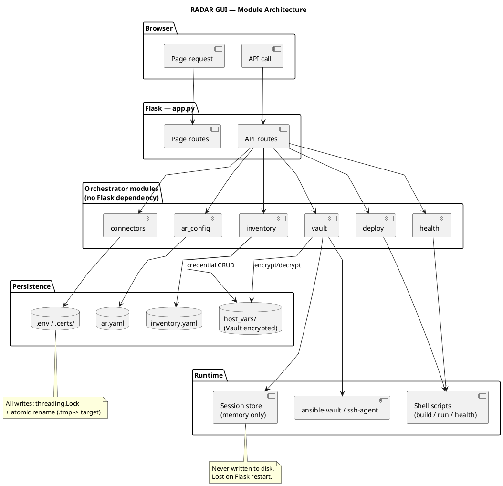

# RADAR GUI software design

This document specifies the software design of the RADAR GUI (`radar/gui/`), a Flask-based web application providing a browser interface for the full RADAR operational lifecycle. It covers the backend-to-frontend architecture, key design decisions, and the credential/session security model. Frontend component internals (HTML structure, JavaScript event wiring, CSS) are out of scope.

## Purpose and scope

The RADAR GUI replaces direct file editing and shell invocation for routine RADAR operations. It wraps `build-radar.sh`, `run-radar.sh`, and `health-radar.sh` with a browser interface, manages `ar.yaml` and `inventory.yaml` through structured forms, stores connector credentials in `.env`, and handles Ansible Vault encryption of sudo passwords through a session-scoped in-memory credential store.

## Module structure

```
gui/
├── app.py                 Flask application: all routes and startup
├── requirements.txt       Runtime dependencies
└── orchestrator/          Backend modules — no Flask dependency
    ├── ar_config.py       Read/write ar.yaml
    ├── inventory.py       Read/write inventory.yaml
    ├── connectors.py      Read/write .env, live connector tests
    ├── deploy.py          Command assembly, subprocess streaming
    ├── health.py          Per-node Ansible health-check execution
    └── vault.py           Ansible Vault wrappers, SSH passphrase session
```

The orchestrator modules are deliberately kept free of Flask imports. This separation allows the file-management and subprocess logic to be tested independently and reused by CLI tooling without importing the web framework.



## Flask application: app.py

### Startup and RADAR_ROOT resolution

`app.py` resolves the RADAR root directory at import time:

```python
RADAR_ROOT = str(Path(os.environ.get("RADAR_ROOT", Path(__file__).parent.parent)).resolve())
```

The default places the root at the parent of `gui/` (i.e., the `radar/` directory). Setting the `RADAR_ROOT` environment variable before starting the server redirects all file I/O to a different installation, enabling the GUI to manage an alternate RADAR root without code changes.

The server runs with `threaded=True` so that long-running streaming responses (build output, health check output) do not block subsequent requests on the same worker.

### Route organisation

Routes are grouped into two sets: page routes and API routes.

**Page routes** (`/`, `/active-responses`, `/infrastructure`, `/connectors`, `/deploy`) render templates with data fetched from the orchestrator modules. They pass only the data needed for initial render; all subsequent interactions go through the API routes via JavaScript.

**API routes** (`/api/...`) are the stable contract between the frontend and the backend.

## Orchestrator modules

### AR configuration management: ar_config.py

Reads and writes `scenarios/active_responses/ar.yaml`. The central design decision is default-block deep-merge: `ar.yaml` contains a `scenarios.default` block that holds baseline values shared across all scenarios. `get_scenario()` loads the full file, starts with a deep copy of the default block, and merges the scenario-specific block on top. This means scenario entries in `ar.yaml` only need to store values that differ from the defaults.

`update_scenario()` applies a partial patch to the existing scenario entry using the same deep-merge logic, so the GUI can send only the changed fields rather than the full config on every save.

All writes use atomic temp-file replacement (`ar.yaml.tmp` -> `ar.yaml`) under a module-level `threading.Lock` to prevent partial writes if two browser sessions submit simultaneously.

### Ansible inventory management: inventory.py

Reads and writes `inventory.yaml` using the four Ansible host groups: `wazuh_manager_local`, `wazuh_manager_ssh`, `wazuh_agents_container`, `wazuh_agents_ssh`.

**Mode inference**: The GUI exposes a simplified `ui_kind` (docker / host) + `is_local` checkbox model. `_resolve_manager_mode()` maps this to the three internal `manager_mode` values (`docker_local`, `docker_remote`, `host_remote`) that the Ansible roles expect. If `ui_kind == "host"`, the result is always `host_remote`. If `ui_kind == "docker"` and `is_local` is set or no IP is provided, the result is `docker_local`; otherwise `docker_remote`.

**Group migration on edit**: When a node's connection type changes (e.g., local to remote), `update_manager()` detects the old group, deletes the host from it, and inserts it into the new group — all within a single locked write, preserving all other inventory entries.

**Credential co-location**: `save_credential()` delegates to `vault.encrypt_host_vars()`, which writes the Ansible Vault-encrypted `host_vars/<name>.yml` file. `delete_manager()` and `delete_agent()` call `delete_credential()` automatically, ensuring no orphaned `host_vars/` files remain after a node is removed.

### External service credentials: connectors.py

Manages credentials and URLs in `.env` at the RADAR root. The module defines `FIELD_MAP`, a 27-entry dict mapping GUI field IDs to environment variable names, and `PASSWORD_KEYS`, a 5-entry subset mapping the five secret field IDs to their environment variable names:

```python
PASSWORD_KEYS = {
    "os-pass":         "OS_PASS",
    "wazuh-pass":      "WAZUH_AUTH_PASS",
    "dashboard-pass":  "DASHBOARD_PASS",
    "smtp-pass":       "SMTP_PASS",
    "decipher-token":  "DECIPHER_TOKEN",
}
```

The `/api/connectors/reveal` endpoint checks the incoming request body key against `set(PASSWORD_KEYS.values())` — the **environment variable names**, not the field IDs. The request must therefore send the environment variable name (e.g. `"OS_PASS"`), and the endpoint refuses any key not in that set of five values.

SSL verification fields (`*-ssl-enabled`) are handled separately from `FIELD_MAP` via a dedicated `ssl_prefix_map` in `save_connector()`: if the value is `"false"`, the corresponding `*_VERIFY_SSL` environment variable is set to `"false"`; if a CA certificate is present in the same request, its content is written to `.certs/<name>-ca.pem` (chmod 0600) and the path is stored as the environment variable value; otherwise the environment variable is set to `"true"`. Certificate content fields (`*-cert-content`) are silently skipped in the main field loop since they are consumed by the SSL branch.

All `.env` writes are performed inside `save_connector()`, `threading.Lock` block. `_write_env()` is called from within that lock and preserves existing comments and unrelated keys by parsing the file line by line, replacing only lines whose key appears in the updated environment dictionary. New keys not previously in the file are appended. The final write uses atomic temp-file replacement (`.env.tmp` -> `.env`).


### Subprocess streaming: deploy.py

Builds the shell command for `build-radar.sh`, `run-radar.sh`, or `health-radar.sh` from the validated spec dict, then streams the subprocess output to the client via Flask's `stream_with_context` generator.

**Validation before execution**: `_validate_scenario()` and `_validate_mode()` raise `ValueError` before any subprocess is spawned if the inputs are invalid. The error is yielded as `[ERROR] ...` to the output stream, not returned as a JSON error, because the stream has already been opened with `mimetype="text/plain"`.

**Vault and SSH context injection**: If the deployment targets remote nodes and encrypted `host_vars/` files exist, `_stream_with_vault()` creates a temp vault password file (via `vault.password_file()`) and passes it as `ANSIBLE_VAULT_PASSWORD_FILE` in the environment, then wraps the subprocess environment in `vault.ssh_askpass_env()` to load the SSH key into a short-lived `ssh-agent`.

**Termination**: The streaming generator wraps `subprocess.Popen` in a `try/finally`. When the operator clicks Stop, the JavaScript frontend calls `AbortController.abort()`, which raises an `AbortError` in the browser and closes the HTTP connection on the client side. Flask's `stream_with_context` generator then has no consumer to yield to, exits its loop, and reaches the `finally` block, which calls `proc.terminate()` followed by `proc.wait(timeout=5)`, then `proc.kill()` if the timeout expires.

**Run action exception**: `stream_run` (Run Anomaly Detector tab) skips vault and SSH pre-flight checks entirely and passes no vault password file to the subprocess. `run-radar.sh` operates only against OpenSearch via HTTP using credentials from `.env` — it requires no Ansible or SSH.

### Per-node health checks: health.py

Runs `ansible-playbook` against the `health_check` role using `subprocess.run()` with a 180-second timeout, passing the node's inventory hostname as the `--limit` value and a set of extra vars including `gui_json_output: true` and a temp file path for structured results.

The playbook writes a JSON file at the temp path during execution. `check_manager()` and `check_agent()` read this file after `subprocess.run()` returns and parse the `checks` array from it. If the file is absent or empty, the function falls back to parsing Ansible's stdout for `OK`/`WARN`/`FAIL`-prefixed lines.

Results are aggregated into an `overall` status: `"fail"` if any check failed, `"warn"` if any check warned and none failed, `"ok"` otherwise. Temp files are deleted in `finally` blocks regardless of outcome.

### Credential session store and SSH agent management: vault.py

**In-memory session store**: Vault passwords and SSH passphrases are stored in module-level dictionaries (`_passwords`, `_ssh_passphrases`) keyed by a session ID (`secrets.token_urlsafe(24)`). The session ID is issued as an HttpOnly, SameSite=Lax cookie (`radar_vault_sid`) on first vault or SSH interaction. Neither the vault password nor the SSH passphrase is ever written to disk in the session store.

**password_file context manager**: When Ansible needs the vault password, it is written to a `tempfile.mkstemp()` file (prefix `radar_vault_`, suffix `.pw`, chmod 0600) for the duration of the `with` block and deleted in `finally`. This satisfies Ansible's `--vault-password-file` requirement while minimising the time the password exists on disk.

**ssh_askpass_env context manager**: When a remote Ansible run is needed with a passphrase-protected SSH key, this context manager:

1. Writes the passphrase to a `tempfile.mkstemp()` file (prefix `radar_sshpp_`, suffix `.txt`, chmod 0600).
2. Writes a one-line `#!/bin/sh; cat <passphrase_file>` script to a second `tempfile.mkstemp()` file (prefix `radar_askpass_`, suffix `.sh`, chmod 0700).
3. Spawns `ssh-agent -s` and parses `SSH_AUTH_SOCK` and `SSH_AGENT_PID` from its stdout.
4. Runs `ssh-add` with `SSH_ASKPASS` pointing to the helper script and `SSH_ASKPASS_REQUIRE=force`.
5. Falls back to `sshpass` if `ssh-add` fails and `sshpass` is installed.
6. Yields the modified environment dict (with `SSH_AUTH_SOCK`, `SSH_AGENT_PID`, and `ANSIBLE_PRIVATE_KEY_FILE` set) to the caller.
7. Kills the agent with `ssh-agent -k` and deletes both temp files in `finally`.

The design decision to use a real `ssh-agent` process rather than passing the passphrase through other means is driven by compatibility: Ansible's SSH connector respects `SSH_AUTH_SOCK` universally, whereas direct passphrase injection is not portable across OpenSSH versions.

**Vault unlock verification**: `api_vault_unlock()` does not accept the vault password on trust. It calls `vault.verify_password()`, which runs `ansible-vault view --vault-password-file <tmp> <file>` against an existing encrypted file in `host_vars/`. Only if that subprocess exits 0 is the password retained in the session. If verification fails, the password is immediately cleared from the session and a 400 error is returned naming the file that failed to decrypt.

## Session and security model

The vault session does not survive a Flask process restart. This is by design: keeping state only in process memory means no session database to maintain, no session files to protect, and a clean security boundary.

The vault badge in the UI reflects session state: amber if encrypted `host_vars/` files exist but the vault is locked, green if unlocked, absent if no encrypted files exist. This state is polled by the frontend via `/api/vault/status` on page load.

## File I/O consistency

All file mutations across the orchestrator modules follow the same pattern:

1. Acquire a module-level `threading.Lock`.
2. Read the current file contents.
3. Apply the change in memory.
4. Write to a `.tmp` sibling file.
5. Atomically rename `.tmp` -> target.
6. Release the lock.

The temp file suffixes by module: `ar.yaml.tmp` (ar_config), `inventory.yaml.tmp` (inventory), `.env.tmp` (connectors). This ensures that a concurrent request or an unexpected process termination during step 4 never leaves a half-written config file.