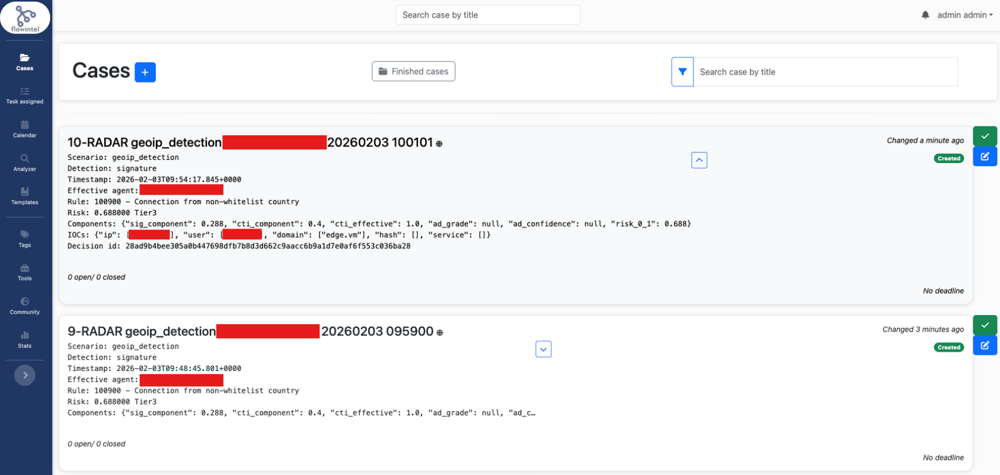

# TCER: RADAR non-whitelist GeoIP detection + Flowintel

## Relevant test environment and configuration details

- Software deviations: aligned with test case specification, with controller node running Ubuntu 22.04.5 LTS (Jammy Jellyfish)
- Hardware deviations: aligned with test case specification (VMs handled via QEMU KVM hypervisor)

## Test execution results

Here we report the results in terms of step-wise alignments or deviations with respect to the expected outcome of the covered test case.

**Test case step 1**: In the Wazuh Dashboard Discovery page, alert with rule ID starting with `10090*` listed.

- ?c5-defect-0: instance observed.

**Test case step 2**: Recipient email address specified in `.env` receives an email about the alert.

- ?c5-defect-0: Email received.

**Test case step 3**: The FlowIntel case is created in the `Cases` menu in FlowIntel defined in `FLOWINTEL_BASE_URL` address.

- ?c5-defect-0: FlowIntel case created.

{: width="80%"}

### Defect summary description

Successful test execution, i.e., defect category: ?c5-defect-0

### Text execution evidence

See linked files (if any), e.g., screenshots, logs, etc.

### Comments

Any additional informative details not fitting in the above sections.

## Guide

- Defect category: ?c5-defect-0; ?c5-defect-1; ?c5-defect-2; ?c5-defect-3; ?c5-defect-4
- Verification method (VM): Test (T), Review of design (R), Inspection (I), Analysis (A)