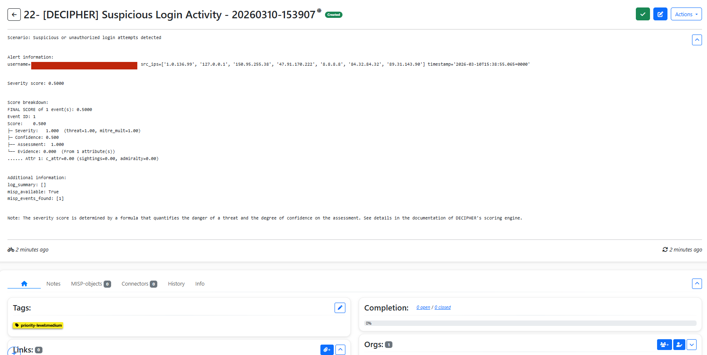
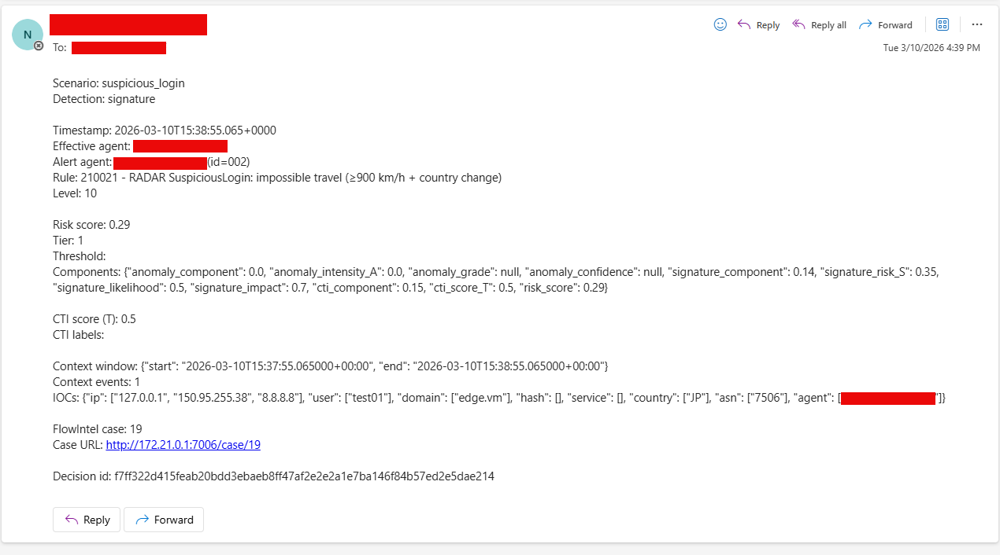

# TCER: DECIPHER-RADAR detection validation for suspicious login

## Relevant test environment and configuration details

- Software deviations: aligned with test case specification, with controller node running Ubuntu 22.04.5 LTS (Jammy Jellyfish)
- Hardware deviations: aligned with test case specification (VMs handled via QEMU KVM hypervisor)

## Test execution results

Here we report the results in terms of step-wise alignments or deviations with respect to the expected outcome of the covered test case. The executed command was as follows:
```
sudo ./simulate-radar.sh suspicious_login --agent remote
```

**Test case step 2.1:** The ansible playbook executes successfully

- ?c5-defect-0: The simulation was successfully executed.

**Test case step 2.2:** In the Wazuh Dashboard Discovery page, at least one of rule IDs `210012`, `210013`, `210020`, or `210021` is triggered for the remote agent

- ?c5-defect-0: Alerts with one of the rule.id : [`210012`, `210013`, `210020`, or `210021`] appear in the Wazuh Dashboard.

**Test case step 2.3:** In Wazuh manager, alert tier verified via `grep "Risk computed" /var/ossec/logs/active-responses.log | tail -1`

- Tier 0:
      - ?c5-defect-0: no email received at `EMAIL_TO`.
      - ?c5-defect-0: no FlowIntel case created.
      - ?c5-defect-0: no mitigation command in `/var/ossec/logs/active-responses.log`.
- Tier 1: (Same alerts were generated, but by putting one of the IPs present in the alert in MISP changed the tier from 0 to 1)
      - ?c5-defect-0: email received at `EMAIL_TO` with risk score, tier, and FlowIntel case URL.
      - ?c5-defect-0: FlowIntel case created and accessible at the URL included in the email.
      - ?c5-defect-0: FlowIntel case contains relevant information about the suspicious login event, related events found in MISP, and a breakdown of the risk score including the assigned tier.
      - ?c5-defect-0: `misp_available: true` appears in the FlowIntel case description, confirmed via `"DECIPHER analyze completed"` log entry matched by `decision_id`.
      - ?c5-defect-0: FlowIntel case is tagged with low priority.
      - ?c5-defect-0: no mitigation command in `/var/ossec/logs/active-responses.log`.

### Defect summary description

?c5-defect-0

### Text execution evidence

FlowIntel case:

{: width="80%"}

Email:

{: width="80%"}

### Comments

Any additional informative details not fitting in the above sections.

## Guide

- Defect category: ?c5-defect-0; ?c5-defect-1; ?c5-defect-2; ?c5-defect-3; ?c5-defect-4
- Verification method (VM): Test (T), Review of design (R), Inspection (I), Analysis (A)