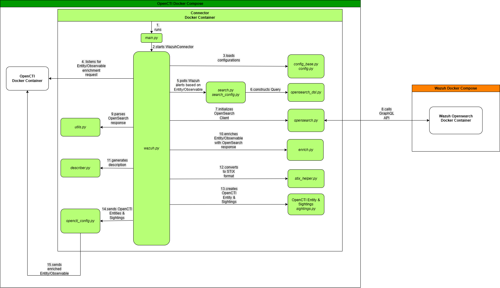

## Overview

The integration between OpenCTI and Wazuh provides a powerful bridge between security event detection and strategic threat intelligence management. Through this integration, real-time alerts generated by Wazuh are sent into OpenCTI, where they are correlated, enriched, and used to inform decision-making in incident response workflows.

**[The OpenCTI–Wazuh Connector](https://misje.github.io/opencti-wazuh-connector/)** - is an enrichment connector that bridges OpenCTI&#39;s threat intelligence with the Wazuh SIEM. It automatically triggers when new entities or indicators are added in OpenCTI, then searches the Wazuh database for matching events.

## Architecture



As an entity is added into the OpenCTI environment, the enrichment connector is automatically activated. This event triggers the initiation of the Python-based process managed by the WazuhConnector Class. The WazuhConnector Class (wazuh.py) serves as the central orchestrator in the OpenCTI-Wazuh Connector: it receives the trigger generated by the new entity and commences execution of its code. After loading necessary configuration variables, it starts querying the Wazuh SIEM’s repository of alerts for any records that correlate with the newly created entity. The query for this process is created in search.py.

During this process, the connector inspects the retrieved alerts and processes them sequentially. The raw information is parsed (utils.py), enriched with additional contextual data (enrich.py and describer.py), and then converted into a standardized format as STIX (stix\_helper.py). Following the enrichment process, the connector pushes the enhanced data back into OpenCTI. The original entity is augmented with comprehensive insights derived from the Wazuh SIEM data.

In this workflow, the term &quot;entity&quot; refers to any structured threat intelligence object within OpenCTI. Entities include, but are not limited to, indicators (e.g., file hashes, IP addresses, URLs), threat actors, campaigns, and observed data.

## Configuration

1. Git clone the opencti-wazuh-connector respository.
2. In the directory, build the opencti-wazuh-connector image:
```
cd opencti-wazuh-connector
docker build -t opencti-wazuh-connector .
```
3. Created image can be used in Wazuh docker compose file:

```yaml
connector-wazuh:
  image: opencti-wazuh-connector
  restart: always
  depends_on:
  opencti:
    condition: service_healthy
  environment:
  # A timezone is needed for datetime tools to work as expected:
    - TZ=UTC
    - USE_TZ=true
    - OPENCTI_URL=http://opencti:8080
    - OPENCTI_TOKEN=${OPENCTI_ADMIN_TOKEN}
    - CONNECTOR_ID=${CONNECTOR_WAZUH_ID}
    - CONNECTOR_NAME=Wazuh
    - CONNECTOR_SCOPE=Artifact,Directory,Domain-Name,Email-Addr,Hostname,IPv4-Addr,IPv6-Addr,Mac-Addr,Network-Traffic,Process,StixFile,Url,User-Account,User-Agent,Windows-Registry-Key,Windows-Registry-Value-Type,Vulnerability,Indicator
    - CONNECTOR_AUTO=true
    - CONNECTOR_LOG_LEVEL=debug
    - CONNECTOR_EXPOSE_METRICS=true
    - WAZUH_APP_URL=https://wazuh.manager:55000
    - WAZUH_OPENSEARCH_PASSWORD=SecretPassword # Remember double-$ if password contains $:
    - WAZUH_OPENSEARCH_URL=https://wazuh.indexer:9200
    - WAZUH_OPENSEARCH_USERNAME=admin
    - WAZUH_OPENSEARCH_VERIFY_TLS=false
    - WAZUH_TLPS=TLP:AMBER+STRICT
    - WAZUH_MAX_TLP=TLP:AMBER
  volumes:
    - /var/cache/wazuh
  links:
    - opencti:opencti
  # Set a limit on logs:
  logging:
    options:
    max-size: 50m
```
4. Set .env variables:
```
OPENCTI_ADMIN_EMAIL=admin@opencti.io
OPENCTI_ADMIN_PASSWORD="" # Password
OPENCTI_ADMIN_TOKEN=dafc7e88-f450-4685-8c2b-187f92b64e3d
OPENCTI_BASE_URL=http://localhost:8080
MINIO_ROOT_USER=opencti
MINIO_ROOT_PASSWORD=GahShu6ziaNie9iSheiW
RABBITMQ_DEFAULT_USER=opencti
RABBITMQ_DEFAULT_PASS=Eik4shah7rojii1raith
CONNECTOR_EXPORT_FILE_STIX_ID=dd817c8b-abae-460a-9ebc-97b1551e70e6
CONNECTOR_EXPORT_FILE_CSV_ID=7ba187fb-fde8-4063-92b5-c3da34060dd7
CONNECTOR_EXPORT_FILE_TXT_ID=ca715d9c-bd64-4351-91db-33a8d728a58b
CONNECTOR_IMPORT_FILE_STIX_ID=72327164-0b35-482b-b5d6-a5a3f76b845f
CONNECTOR_IMPORT_DOCUMENT_ID=c3970f8a-ce4b-4497-a381-20b7256f56f0
SMTP_HOSTNAME=localhost
ELASTIC_MEMORY_SIZE="512M"
```

### Troubleshooting of configuration

1.  TLS handshake timeout. The error comes from not reaching to OpenCTI as Connector runs earlier than OpenCTI itself is deployed. Thus, depends\_on needs to be added:
    

```yaml
depends_on:
  opencti:
    condition: service_healthy
```

2. max\_tlp Field required \[type=missing, input\_value={&#39;tlps&#39;: &#39;TLP:AMBER+STRIC...://wazuh.manager:55000&#39;}, input\_type=dict\]. Environmental variable should be added to the Connector service.
    

```yaml
- WAZUH_MAX_TLP=TLP:AMBER
```

3. If opencti-openbas integration steps are followed, then the network configuration should be added to the docker-compose.yml:
```yaml
  connector-wazuh:
    ...
    networks:
      - opencti-wazuh-network
    ...
```
        

## Automated Triggering Instructions

* The connector itself requires manual triggering of each Observable in OpenCTI UI.

To automate Enrichments for better performance, an automation script was developed.
To trigger automated enrichment for all Observables, follow the instructions in automated_trigger directory.

The use case of automated trigger: An Anomaly occurence will trigger automated enrichment for OpenCTI, as a result delivers comprehensive contextual data. 


## Troubleshooting

If there is an issue with connector during enrichment, the official troubleshooting page would be helpful: [https://misje.github.io/opencti-wazuh-connector/troubleshooting.html](https://misje.github.io/opencti-wazuh-connector/troubleshooting.html).


## Findings

During the enrichment phase, it is possible to encounter a scenario where the connector reports a &quot;No hit&quot; status. This indicates that the Wazuh OpenSearch query returned an empty response, and as a result, no related events were ingested or linked in OpenCTI. Even if Wazuh has stored relevant security events, these events may not be detected by the connector during enrichment. The OpenCTI-Wazuh connector uses a set of predefined, hardcoded field names when querying OpenSearch for matches. The query fields are hardcoded in source code in the path src/wazuh/search.py:

> If Wazuh stores relevant information in different fields not included in the connector’s query, these events will not be retrieved.

If Wazuh setup uses custom field names or stores data in fields not covered by the connector’s defaults, it may need to extend or modify the connector’s query logic to match the environment.

After deploying the updated Docker image, the connector was able to retrieve matching events from Wazuh during enrichment. Despite successful enrichment, event parsing did not succeed. This occurred due to the connector’s expectations regarding the structure of OpenSearch responses.


## Connector fix

1) Field path fix for phishing logs

The connector had been looking in the wrong place for the sender/recipient (no data.email.sender path in src/wazuh/search.py). That mapping was corrected so the JSON structure produced by the phishing detector matches what the ingestion code expects.

2) Flexible timestamp parsing

The connector was fixed by adjusting to flexible timestamp parse.

These timestamp handlers were added to in wazuh.py and sightings.py


## Integration Assessment

<figure class="table op-uc-figure_align-center op-uc-figure" style="width:868pt;"><table class="op-uc-table"><tbody><tr class="op-uc-table--row"><td class="op-uc-table--cell" style="height:23.62pt;width:217pt;"><p class="op-uc-p"><strong>KPI</strong></p></td><td class="op-uc-table--cell" style="width:217pt;"><p class="op-uc-p"><strong>Definition</strong></p></td><td class="op-uc-table--cell" style="width:217pt;"><p class="op-uc-p"><strong>Target</strong></p></td><td class="op-uc-table--cell" style="width:217pt;"><p class="op-uc-p"><strong>Measurement</strong></p></td></tr><tr class="op-uc-table--row"><td class="op-uc-table--cell" style="height:94.48pt;width:217pt;"><p class="op-uc-p"><strong>Decoder &amp; Rule Coverage</strong></p></td><td class="op-uc-table--cell" style="width:217pt;"><p class="op-uc-p">Percentage of log events and detection scenarios correctly parsed and mapped to STIX in OpenCTI.</p></td><td class="op-uc-table--cell" style="width:217pt;"><p class="op-uc-p">≥ 95 % of high-priority events</p></td><td class="op-uc-table--cell" style="width:217pt;"><p class="op-uc-p">Regular check all high-priority alerts and count how many were properly detected by the rules and parsed by decoders.</p></td></tr><tr class="op-uc-table--row"><td class="op-uc-table--cell" style="height:76.77pt;width:217pt;"><p class="op-uc-p"><strong>Connector Adaptability</strong></p></td><td class="op-uc-table--cell" style="width:217pt;"><p class="op-uc-p">Speed and completeness of connector updates after any decoder, rule or log‐format change.</p></td><td class="op-uc-table--cell" style="width:217pt;"><p class="op-uc-p">≥ 95 % OpenCTI receives Sightings</p></td><td class="op-uc-table--cell" style="width:217pt;"><p class="op-uc-p">Regular updates of decoder/rule commits.</p></td></tr></tbody></table></figure>